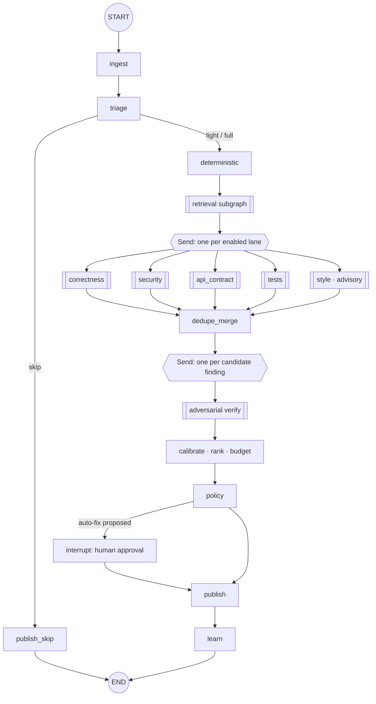
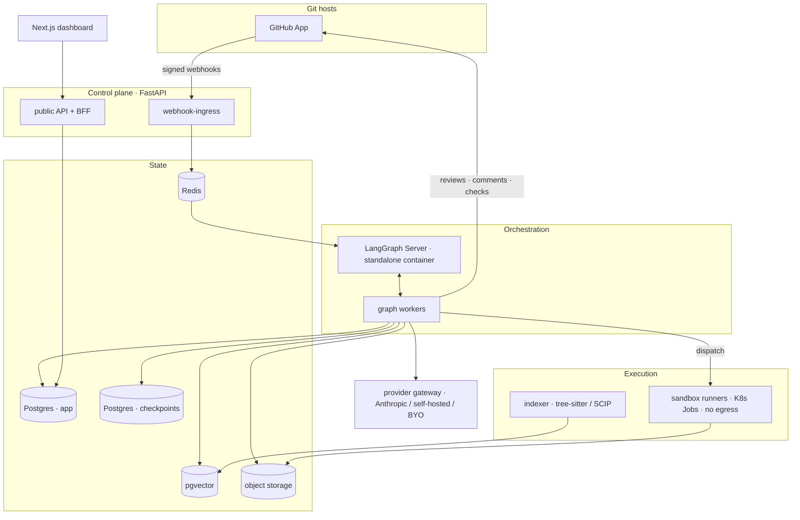

# Quorum

**An autonomous code review pipeline that only speaks when it can prove it.**

Quorum reviews pull requests with a multi-agent [LangGraph](https://docs.langchain.com/oss/python/langgraph/overview)
state machine. Deterministic analyzers run first. Specialised review lanes reason over the diff
with retrieved repository context. Every candidate finding is then handed to an **adversarial
verifier** that tries to prove it wrong — and only the findings that survive are ranked, budgeted,
and posted to the pull request.

> **Status:** Full production-grade implementation complete. This repository contains the complete
> Quorum pipeline codebase across `packages/`, `services/`, `apps/`, `evals/`, and `tests/`,
> implementing the multi-agent review architecture specified in
> [`quorum_build_package/`](quorum_build_package/). See [Developer quickstart](#developer-quickstart).

---

## Table of contents

- [Why this exists](#why-this-exists)
- [What Quorum does](#what-quorum-does)
- [How it works](#how-it-works)
  - [The review graph](#the-review-graph)
  - [Evidence classes](#evidence-classes)
  - [The verifier](#the-verifier)
  - [The comment budget](#the-comment-budget)
  - [Adaptive model routing](#adaptive-model-routing)
- [What a review looks like](#what-a-review-looks-like)
- [Architecture](#architecture)
- [Technology stack](#technology-stack)
- [Configuration](#configuration)
- [CLI](#cli)
- [API](#api)
- [Security, privacy and authentication](#security-privacy-and-authentication)
- [Self-hosting](#self-hosting)
- [Quality: how we know it works](#quality-how-we-know-it-works)
- [Pricing model](#pricing-model)
- [Roadmap](#roadmap)
- [Developer quickstart](#developer-quickstart)
- [Document map](#document-map)
- [Non-goals](#non-goals)
- [Glossary](#glossary)

---

## Why this exists

Automated PR review is now table stakes, and it is broadly distrusted. Independent 2026
benchmarking of AI review agents ranks tools by precision because precision is what separates
them, and third-party analysis reports that the majority of AI review comments are style noise
rather than defects. The failure mode is predictable:

> A reviewer that is wrong 30% of the time trains engineers to skim, then to mute, then to uninstall.

Every product in the category is optimising for *finding more*. Quorum optimises for *being right*,
and treats "found nothing" as a legitimate, explainable output.

**The thesis:** an automated reviewer should behave like a good senior engineer who is short on
time — say few things, be able to prove each one, and stay quiet otherwise.

That is a pipeline problem, not a prompt problem, which is why Quorum is a graph.

---

## What Quorum does

| | |
|---|---|
| **Reviews pull requests automatically** | On open, on every push, or on demand via `@quorum review` |
| **Runs deterministic analysis first** | Linters, type checkers, SAST, secret scanning, dependency audit, impacted tests, existing CI signals — all ground truth before a model is asked anything |
| **Reasons in parallel lanes** | Correctness, security, API contract, tests (plus performance, data migration, concurrency); style is advisory only |
| **Verifies adversarially** | A separate agent with a fresh context and read-only tools tries to refute every finding |
| **Posts a small number of comments** | A hard per-PR budget, ranked by severity × calibrated confidence × blast radius |
| **Shows its work** | Every comment traces to its evidence, the refutation attempt, the model, the prompt version, and the graph run |
| **Learns from dismissals** | Resolution reasons feed suppressions and per-repo confidence calibration |
| **Never writes without a human** | Auto-fix pauses the graph and resumes only on a recorded approval |
| **Runs anywhere** | Managed, self-hosted container, or air-gapped with your own model endpoint |

---

## How it works

### The review graph



Each stage exists to remove a class of error:

| Stage | Removes |
|---|---|
| `triage` | Wasted spend on diffs that cannot contain a defect (lockfiles, generated code, vendored paths) |
| `deterministic` | Anything a compiler, linter, scanner or test can decide — models are never asked questions with a deterministic answer |
| `retrieval` | Findings that are wrong because the model never saw the caller, the guard, or the test |
| lanes | Cross-domain mush; each lane has one charter and discards duplicates from others |
| `dedupe_merge` | The same defect reported four times in four voices |
| `verify` | Plausible-sounding findings that a second look refutes |
| `rank` + budget | The noise that buries the two comments that mattered |
| `policy` | Model opinions masquerading as team decisions |

The graph is durable: state is checkpointed to Postgres, so a worker crash resumes at the last
completed node rather than re-reviewing the PR, and a human approval three days later resumes the
*same* run.

### Evidence classes

A finding must declare how it is known:

| Class | Meaning |
|---|---|
| `static_tool` | A linter, type checker, or scanner reported it |
| `test_failure` | A test fails, or a changed branch has no test covering it |
| `symbol_resolution` | The claim was checked against resolved definitions, callers, or callees |
| `spec_violation` | It contradicts a schema, interface, migration guarantee, or declared rule |
| `reproduction` | A concrete input/state path to the failure was constructed |
| `heuristic` | Pattern-matching only |

**A finding whose only evidence class is `heuristic` is never posted.** It stays visible in the
dashboard, ranked and searchable — it just does not interrupt anyone. Every citation must resolve
at the pull request's head commit or the finding is withdrawn.

### The verifier

The single most important component. It receives the finding, the diff hunk, and **read-only
tools** (`read_file`, `find_symbol`, `find_references`, `read_test`, `git_log_for_lines`), and it
is instructed to *refute*, not to evaluate:

> Your job is to REFUTE it. You are not asked whether it sounds reasonable. You are asked to find
> the specific reason it is wrong: a guard that already exists, a caller that supplies the missing
> value, a type that makes the state unreachable, a test that already covers it, or a misreading.

Four rules are enforced in code, never left to the prompt:

1. At least one read tool must have been called, or the verdict is forced to `unprovable`.
2. Every cited line span must resolve at the head SHA, or the verdict is forced to `unprovable`.
3. `refutation_attempt` must be substantive — "none" is a schema failure, not an answer.
4. The verifier never sees the lane's confidence score, so it cannot anchor on it.

Verdicts are `confirmed`, `refuted`, or `unprovable`. **Only `confirmed` can post**, through any
code path, including manual promotion from the dashboard. Where two providers are configured, the
verifier deliberately runs on the *other* one — a finding hallucinated by one vendor's model should
not be confirmed by the same vendor's model.

### The comment budget

Confirmed findings are ranked:

```
rank_score = severity_weight × calibrated_confidence × blast_radius × recency_penalty

severity_weight = { critical: 10, high: 6, medium: 3, low: 1.5, info: 0.5 }
```

The top *N* (default **8**, configurable 1–25) post inline. Everything else is held, counted in the
summary, and one click away in the dashboard. Style findings never consume budget. Confidence is
calibrated per repo and per finding category from your team's own dismissal reasons, so the ranking
adapts to what your reviewers actually act on.

If the budget is too tight, the product tells on itself: **held-finding promotion rate** is a
tracked health metric, and above 10% the budget is considered miscalibrated.

### Adaptive model routing

Model strength is spent where it changes the outcome. A pure, deterministic router picks a tier per
call from signals known in advance — hunk risk, lane, path sensitivity, diff complexity, historical
lane yield, remaining budget, latency headroom, provider health — and escalates **once** when a
defined trigger fires (the lane requests it, schema repair was needed, a high-severity finding lands
in the ambiguous confidence band, the verifier says `unprovable` with missing context, two lanes
disagree, or a cheap tier found nothing on a sensitive path).

Guardrails that make this safe rather than merely cheap:

- One escalation per call. No tier ladders.
- A per-run escalation budget (default 3).
- Floors per node class — **`verify` never economises**, and `security` never drops below mid tier.
- Never to a provider you have not configured.
- Routing decisions form a **route plan**, cached and reused on re-runs and replays, so the same PR
  does not get a different answer tomorrow.
- Routing never varies by customer plan. A free-tier finding is verified by the same model as an
  enterprise one.

A candidate policy runs in **shadow mode** first and is promoted only if precision and recall stay
within 1 point of an all-strong baseline while median cost falls at least 25%.

---

## What a review looks like

**One summary comment**, edited in place on every subsequent run — never re-posted:

````markdown
2 issues worth your attention · 6 held · all lanes completed

| Severity | Location | Issue |
|----------|----------|-------|
| high     | payments/refund.py:118 | Refund retry drops the idempotency key |
| medium   | api/schemas.py:44      | Response field removed without a version bump |

<details><summary>What was checked</summary>
Lanes: correctness, security, api_contract, tests
Deeply reviewed: 7 files · Skimmed: 0 files
Analyzers: ruff, mypy, semgrep, gitleaks (all passed)
Held below budget: 6 · Suppressed by your rules: 3 · Refuted by verification: 5
Run: 74s · 3.1 credits · pipeline 2026.09.1
</details>

Machine-generated review · view evidence and reasoning · reply `@quorum explain 4f2`
````

**Inline comments**, posted as a *single* review so the author gets one notification rather than
eight:

````markdown
**high** · correctness · confidence 0.79

On retry, `refund_payment()` regenerates `idempotency_key`, so a duplicate refund can be issued.

`retry_wrapper` (retries.py:44) calls `refund_payment` without a key, so the default factory
runs on every attempt. Evidence: symbol_resolution, test_failure.

```suggestion
def refund_payment(charge_id: str, *, idempotency_key: str) -> Refund:
```

Verified · [why this was flagged](#) · `@quorum dismiss 4f2 <reason>`
````

And a `quorum/review` **check run**, which is `neutral` by default — blocking is always an explicit,
owner-level escalation, never a default.

---

## Architecture



**Trust boundaries.** The sandbox receives code and a task, never credentials or database access.
Model providers are the only egress path for repository content. Repository content never crosses
an org boundary — enforced by `org_id` scoping on every query, Postgres row-level security, and
per-org namespacing in object storage and the vector index.

**Failure handling** is specified per class rather than left to chance: webhook payloads are
persisted before acknowledgement and replayable for 7 days; a worker crash resumes from the last
checkpoint with at most one node re-executed; a provider outage degrades one lane and the summary
names it; comment posting honours secondary rate limits and never double-posts.

---

## Technology stack

| Layer | Choice | Why |
|---|---|---|
| Orchestration | **LangGraph** (Python) — `StateGraph`, subgraphs, `Send` fan-out, `interrupt()`, `AsyncPostgresSaver`, `durability="async"` | Durable, resumable, inspectable runs; fan-out and human-in-the-loop are primitives, not plumbing |
| Runtime | **LangGraph Server**, standalone container | Self-hostable from day one |
| Control plane | **FastAPI** (Python 3.12, `uv` workspace) | Async, typed, OpenAPI-generating |
| Queue | **Redis 7** Streams + consumer groups; KEDA autoscaling | Lease semantics that match run resumption |
| Sandbox | **Kubernetes Jobs** — rootless, read-only rootfs, deny-all egress, ephemeral volume | Untrusted code execution is the highest-risk surface |
| Database | **PostgreSQL 16** ×2 (app + checkpoints), monthly partitions, RLS | Retention becomes a partition drop; checkpoint churn stays isolated |
| Vectors | **pgvector** (HNSW) | One fewer datastore until scale demands otherwise |
| Index | **tree-sitter**, call/import/inheritance graph, SCIP/LSIF import | Retrieval quality is the real ceiling on finding quality |
| Objects | S3-compatible (MinIO locally) | Traces, analyzer output, exports |
| Analyzers | ruff, eslint, mypy, tsc, semgrep, gitleaks, pip-audit, pytest → SARIF | Deterministic ground truth before any model call |
| Models | Provider-abstracted; **Claude Opus 5** (verify, fix), **Claude Sonnet 5** (lanes), **Claude Haiku 4.5** (triage) | Strength where it changes the answer; BYO endpoint supported |
| Frontend | **Next.js 15** + TypeScript + Tailwind, SSE for live runs | |
| CLI | Python, shares the same graph package | Local review runs the identical pipeline |
| Billing | **Stripe** — seats + credits | |
| Observability | OpenTelemetry, Prometheus/Grafana, optional LangSmith | Per-node spans carry model, tier, prompt version |
| CI/CD | GitHub Actions → lint, types, tests, SBOM, cosign, migration dry-run, **blocking eval gate** | A quality claim needs a gate, not a promise |

---

## Configuration

Repository settings live in the dashboard, in `.quorum.yaml`, or both — the file wins, and the UI
shows which layer set each value.

```yaml
# .quorum.yaml
version: 1

review:
  state: active            # disabled | observe | active
  comment_budget: 8        # hard cap on posted inline comments (1-25)
  min_post_severity: medium
  language: en

lanes:
  correctness:   { enabled: true }
  security:      { enabled: true, severity_ceiling: critical }
  api_contract:  { enabled: true }
  tests:         { enabled: true }
  style:         { enabled: true, advisory: true }   # never consumes budget

paths:
  exclude: ["vendor/**", "**/*.generated.ts", "**/migrations/legacy/**"]
  security_sensitive: ["auth/**", "payments/**", "**/crypto/**"]

policy:
  check_run_conclusion: neutral    # neutral | failure_on_blocking
  blocking_severity: null          # null = never fail CI
  may_request_changes: false
  may_approve: false
  autofix: off                     # off | suggest | pr_with_approval

analyzers:
  enabled: [ruff, mypy, semgrep, gitleaks]
  test_command: "pytest -q --timeout=60"

models:
  routing:
    mode: adaptive                 # static | adaptive | shadow
    escalation_budget: 3
    max_tier: 3

rules:
  - name: "no direct SQL in handlers"
    statement: "HTTP handlers must not build SQL strings; use the repository layer."
    paths: ["api/**"]
    severity: high
```

Rules can carry their own **spec cases** ("should flag" / "should not flag" code samples). A rule
that fails its spec cannot be enabled — a convention you cannot test is a convention Quorum will not
enforce on your team's behalf.

---

## CLI

```bash
quorum login                                    # device-code flow
quorum review --pr 412                          # review an open PR
quorum review --diff patch.diff --format sarif  # local, pipeable
quorum review --range main...HEAD               # pre-push check
quorum config --effective                       # merged config + source of each key
quorum trace <run_id>                           # pull a run trace for inspection
```

Exit codes: `0` no blocking findings · `1` blocking findings · `2` run error · `3` config error.

With a local model endpoint configured, `quorum review` runs **fully offline**. Without any model,
it degrades to deterministic-only mode — analyzers plus pattern-expressible rules, still emitting
valid SARIF. That mode is also a genuine offering for teams that will not send code to a model at
all.

---

## API

Versioned REST at `/v1`, OpenAPI 3.1 at `/v1/openapi.json`, cursor pagination, RFC 9457 problem
details, `Idempotency-Key` on every creating POST.

```http
POST /v1/runs                  # request a review
GET  /v1/runs?repo_id=…&state=…
GET  /v1/runs/{id}/events      # SSE: node.started, finding.verified, run.finished
GET  /v1/runs/{id}/trace       # node-by-node, with routed tier and escalation reason
POST /v1/runs/{id}/resume      # answer a human-in-the-loop interrupt
GET  /v1/findings?run_id=…
POST /v1/findings/{id}/feedback
POST /v1/findings/{id}/suppress
GET  /v1/repos/{id}/config     # effective config with per-key source
PUT  /v1/providers/routing     # routing policy
POST /v1/privacy/export        # NDJSON of everything
POST /v1/privacy/delete
```

Outbound webhooks (`run.completed`, `finding.posted`, `budget.threshold`,
`autofix.awaiting_approval`) are HMAC-signed with a timestamped signature and retried five times
over six hours.

---

## Security, privacy and authentication

**Authentication** — OAuth with the Git host or SAML/OIDC SSO with SCIM; device-code flow for the
CLI; scoped, Argon2id-hashed API tokens with mandatory expiry; HMAC-signed webhooks with a
5-minute freshness window; GitHub App installation tokens minted per run and never persisted; mTLS
between internal services. Sessions are opaque server-side records in HTTP-only cookies — not JWTs
in `localStorage` — with 12h idle / 30d absolute lifetimes and per-device revocation.

**Step-up re-authentication** is required for deletion, credential changes, routing changes, SSO
configuration, and any policy escalation (blocking, request-changes, approve, auto-fix).

**Authorization** — four roles (`owner`, `maintainer`, `member`, `auditor`) against a full
capability matrix, enforced by a single decorator with a contract test asserting no route defaults
to allow. Repository visibility is **intersected with your permissions on the Git host**: a repo you
cannot read there is absent from API responses here, not merely hidden in the UI.

**Privacy** — repository checkouts live only in the ephemeral sandbox volume and are destroyed at
run end. Persisted evidence excerpts are capped (default 40 lines) and secret-redacted, and an org
can disable excerpt persistence entirely. Export and deletion are self-serve, with a 24-hour
cancellation window and a completion certificate.

**Prompt injection** — repository content, PR text and code comments are attacker-controllable, and
are treated as data throughout: structural separation with labelled untrusted blocks, sanitisation,
an injection classifier that quarantines affected findings, read-only tools for every model, and
**deterministic publication** — no model can post a comment, write a file, run a command, or change
policy. The adversarial corpus is a blocking release gate: zero instruction-following, zero
system-prompt leakage.

**No developer surveillance.** There are no per-author quality metrics anywhere in the schema.
Analytics aggregate by repo and lane. This is a design constraint, not a setting.

---

## Self-hosting

```bash
helm install quorum ./deploy/helm/quorum -f values.yaml
# or, single node:
docker compose -f deploy/selfhost/docker-compose.yml up
```

A self-hosted deployment sends **nothing** outbound except your configured model endpoint and an
optional licence heartbeat that can be replaced with an offline licence file. Telemetry is opt-in
and off by default. Air-gapped installs run against a local model endpoint, or in deterministic-only
mode with no model at all. Licences fail *open* — a licence-server hiccup warns, it does not shut
off your review pipeline.

---

## Quality: how we know it works

Precision claims are worthless without a gate, so the eval harness is part of CI and blocks merges.

**Corpora**

| Corpus | Contents | Role |
|---|---|---|
| `bench-clean` | 300 PRs with no known defect | **Any** posted finding is a false positive — the precision gate |
| `bench-injected` | 400 PRs with deliberately injected defects | Recall against known ground truth |
| `bench-historical` | 600 PRs where a later commit fixed a bug the PR introduced | Realistic recall |
| adversarial | Injection attempts in code comments, PR bodies, filenames, fixtures | Safety gate |

**Blocking gates:** `bench-clean` false-positive rate ≤5% · posted-finding precision ≥90% · recall
≥60% on `bench-injected` · no metric down >2 points versus the previous pipeline version · cost
within 15% of baseline · calibration error ≤0.08 · zero adversarial failures · determinism (the
same PR three times varies by at most one finding).

Plus a **golden set** of 30 hand-labelled PRs whose output diff a human reads every release — the
last line of defence against a plausible-looking regression that aggregate metrics miss.

Prompt and model changes ship behind the gate, then roll out to 5% of runs with a live
acceptance-rate comparison before going wide.

---

## Pricing model

Hybrid seat + credit, designed against the category's observed pricing failure: **no surprise
bills, ever.** The default overage policy is to degrade to observe mode, not to charge.

| | Free | Team | Business | Enterprise |
|---|---|---|---|---|
| Price | $0 | $19/dev/mo | $39/dev/mo | Custom |
| Credits | 150/org | 300/seat | 800/seat | Negotiated |
| Lanes | correctness, security | + api_contract, tests, style | + performance, migration, concurrency, rules | + custom lanes |
| Self-host / BYO model | — / — | — / yes | add-on / yes | included / yes |

The free tier includes the **full verification pipeline** — a free-tier comment is as verified as an
enterprise one. What scales with price is breadth, governance and volume, never the quality of the
findings that do get posted. There is also a quality refund: if your posted-comment acceptance rate
over a billing period is below 50%, that period is refunded on request.

---

## Roadmap

| Milestone | Delivers | Exit criterion |
|---|---|---|
| **M0** Foundations | Monorepo, CI, local stack, tenancy, checkpoint smoke test | One-command dev stack; cross-org isolation proven |
| **M1** Skeleton pipeline | Webhook → sandbox → single lane → one comment | A real PR gets an accurate comment in <3 min; killed worker resumes without duplicating |
| **M2** Verification | Verifier, evidence gating, ranking, budget, eval harness | ≤1 posted finding per 20 clean PRs; eval blocks merges |
| **M3** Multi-lane | Indexer, retrieval, four lanes, trace UI, provider fallback | p50 first comment ≤90s; precision ≥90% |
| **M4** Commercial | Auth, roles, policy, billing, privacy, self-host artefacts | External team installs unaided; deletion completes end to end |
| **M5** GA | Accessibility, pentest, load, marketplace | Acceptance ≥70%; mute rate <5%; zero critical findings |
| **M6** P1 | GitLab, auto-fix, rules with specs, learnings, calibration, **adaptive routing** | Acceptance ≥80%; routing cuts cost ≥25% within 1 point of baseline |
| **M7** P2 | More hosts, repo Q&A, test generation, IDE, custom lane SDK, SOC 2 | Per item, gated on evidence of demand |

Three sequencing rules are non-negotiable: **the eval harness precedes the second lane**,
**verification precedes breadth**, and **adaptive routing ships after calibration** — a cost
optimisation without a measurement is a quality regression waiting to be found by a customer.

---

## Developer quickstart

The Quorum codebase is organized as a modular Python monorepo adhering strictly to the architecture boundaries defined in [`quorum_build_package/16_REPO_STRUCTURE.md`](quorum_build_package/16_REPO_STRUCTURE.md).

### Monorepo layout

- **[`packages/core`](packages/core)** (`quorum_core`): Pure domain models, fingerprinting, ranking, policy evaluation, suppressions, and config merging (100% pure domain, 0 I/O).
- **[`packages/prompts`](packages/prompts)** (`quorum_prompts`): Prompt registry and versioned prompt assets across all review lanes.
- **[`packages/providers`](packages/providers)** (`quorum_providers`): Multi-provider LLM gateway (Anthropic, OpenAI-compatible, Local test stub), adaptive router, route plan caching, and token redaction.
- **[`packages/vcs`](packages/vcs)** (`quorum_vcs`): Git host client abstraction (GitHub App integration and deterministic test fake).
- **[`packages/analysis`](packages/analysis)** (`quorum_analysis`): Analyzer registry, SARIF parsing, and static analysis runner.
- **[`packages/indexing`](packages/indexing)** (`quorum_indexing`): AST code parsing, symbol graph, and hybrid search.
- **[`packages/storage`](packages/storage)** (`quorum_storage`): SQLAlchemy 2.0 ORM with strict multi-tenant `org_id` scoping, repositories, Redis cache, and S3 object storage.
- **[`packages/telemetry`](packages/telemetry)** (`quorum_telemetry`): OpenTelemetry spans and redacting structured logging.
- **[`packages/graph`](packages/graph)** (`quorum_graph`): Multi-agent LangGraph state machine with parallel review lanes, adversarial verifier, evidence gating, and human approval interrupts.
- **[`services/`](services/)**: Control plane services: webhook ingress (`quorum_ingress`), worker daemon (`quorum_worker`), REST API (`quorum_api`), and sandbox runner (`quorum_runner`).
- **[`apps/`](apps/)**: CLI tool (`apps/cli/quorum_cli`) and Next.js 15 web dashboard (`apps/web`).
- **[`evals/`](evals/)**: Evaluation corpora (`bench-clean`, `adversarial`) and automated precision/safety gates.
- **[`tests/`](tests/)**: Architectural boundary tests, unit test suites, and integration tests.

### Running checks and tests

```bash
# Run all test suites (architecture boundary tests, unit tests, integration tests)
make test

# Run architecture boundary tests only (enforces Rules 1-7 from 16_REPO_STRUCTURE.md)
make test-architecture

# Run AI eval gates (precision gate on bench-clean, safety gate on adversarial injection)
make eval

# Run static syntax and compilation checks
make lint

# Run a sample CLI local review producing standard SARIF output
make cli-review
```

---

## Document map

| Document | Contents |
|---|---|
| [`00_REFERENCE_ANALYSIS.md`](quorum_build_package/00_REFERENCE_ANALYSIS.md) | Category analysis with a Verified / Strongly inferred / Proposed evidence ledger |
| [`01_PRD.md`](quorum_build_package/01_PRD.md) | Personas, jobs to be done, scope, `FR-001`+ requirements, NFRs, KPIs |
| [`02_UX_SCREEN_SPEC.md`](quorum_build_package/02_UX_SCREEN_SPEC.md) | 17 screens + in-PR and CLI surfaces, every state |
| [`03_USER_FLOWS.md`](quorum_build_package/03_USER_FLOWS.md) | First run, review, dispute, auto-fix, billing, deletion, 13 failure paths |
| [`04_SYSTEM_ARCHITECTURE.md`](quorum_build_package/04_SYSTEM_ARCHITECTURE.md) | Services, graph topology, sandbox, deployment, scaling, observability |
| [`05_DATA_MODEL.md`](quorum_build_package/05_DATA_MODEL.md) | Full SQL DDL, indexes, retention, migrations |
| [`06_API_SPEC.md`](quorum_build_package/06_API_SPEC.md) | Endpoints with request/response examples, errors, webhooks |
| [`07_AI_OR_AUTOMATION_PIPELINE.md`](quorum_build_package/07_AI_OR_AUTOMATION_PIPELINE.md) | State, nodes, routing, cost budgets, evals, injection defence |
| [`08_SAFETY_PRIVACY_COMPLIANCE.md`](quorum_build_package/08_SAFETY_PRIVACY_COMPLIANCE.md) | Data inventory, retention, processors, regulatory checklist |
| [`09_AUTH_AND_PERMISSIONS.md`](quorum_build_package/09_AUTH_AND_PERMISSIONS.md) | Auth mechanisms, roles, permission matrix, enforcement |
| [`10_OFFLINE_SYNC_AND_STORAGE.md`](quorum_build_package/10_OFFLINE_SYNC_AND_STORAGE.md) | Degraded modes, caching, resume, conflicts, backups |
| [`11_MONETIZATION_AND_BILLING.md`](quorum_build_package/11_MONETIZATION_AND_BILLING.md) | Plans, metering, entitlements, refunds |
| [`12_ANALYTICS_AND_OBSERVABILITY.md`](quorum_build_package/12_ANALYTICS_AND_OBSERVABILITY.md) | Events, metrics, dashboards, alerts, never-log list |
| [`13_TEST_PLAN.md`](quorum_build_package/13_TEST_PLAN.md) | Unit → E2E, security, performance, chaos, AI evals |
| [`14_IMPLEMENTATION_ROADMAP.md`](quorum_build_package/14_IMPLEMENTATION_ROADMAP.md) | M0–M7 with exit criteria |
| [`15_PRODUCT_BACKLOG.md`](quorum_build_package/15_PRODUCT_BACKLOG.md) | Ten epics, actionable P0/P1/P2 tasks |
| [`16_REPO_STRUCTURE.md`](quorum_build_package/16_REPO_STRUCTURE.md) | Monorepo tree and enforced boundaries |
| [`17_DESIGN_SYSTEM.md`](quorum_build_package/17_DESIGN_SYSTEM.md) | Tokens, components, motion, accessibility |
| [`18_RELEASE_CHECKLIST.md`](quorum_build_package/18_RELEASE_CHECKLIST.md) | Per-release, GA, and self-hosted gates |
| [`19_PROMPT_LIBRARY.md`](quorum_build_package/19_PROMPT_LIBRARY.md) | Versioned prompts with JSON schemas |
| [`20_ACCEPTANCE_CRITERIA.md`](quorum_build_package/20_ACCEPTANCE_CRITERIA.md) | Given/When/Then for critical behaviour |
| [`21_RISKS_AND_OPEN_QUESTIONS.md`](quorum_build_package/21_RISKS_AND_OPEN_QUESTIONS.md) | Risks, 14 open decisions, unknowns to resolve with data |
| [`SOURCES.md`](quorum_build_package/SOURCES.md) | Sources with access dates and caveats |

---

## Non-goals

Quorum is **not**: an IDE extension or an autonomous coding agent; a repository chat product (P2 at
the earliest); a replacement for CI; a SAST engine (it orchestrates existing ones); a test
generator in MVP; a supporter of non-Git version control, ever; and emphatically not a developer
productivity scorecard.

---

## Glossary

| Term | Meaning |
|---|---|
| **Lane** | An independent review perspective with one charter (correctness, security, …), implemented as a LangGraph subgraph |
| **Candidate** | A finding a lane produced, before verification |
| **Confirmed** | A finding a verifier tried and failed to refute — the only kind that can post |
| **Held** | A confirmed finding below the comment budget: visible in the dashboard, not posted |
| **Evidence class** | How a finding is known; `heuristic`-only never posts |
| **Comment budget** | The hard cap on posted inline comments per PR |
| **Fingerprint** | A stable finding identity across runs, surviving line shifts |
| **Route plan** | The set of model-tier decisions for a run, cached so re-runs reproduce them |
| **Run key** | `repo:pr:head_sha:config_version:pipeline_version` — the idempotency and LangGraph thread id |
| **Observe mode** | A repo where Quorum analyses fully but posts nothing |

---

*Quorum is an original product design. It is inspired by the AI code-review category but copies no
product's name, branding, prompts, source, or visual identity; see
[`00_REFERENCE_ANALYSIS.md` §8](quorum_build_package/00_REFERENCE_ANALYSIS.md).*
