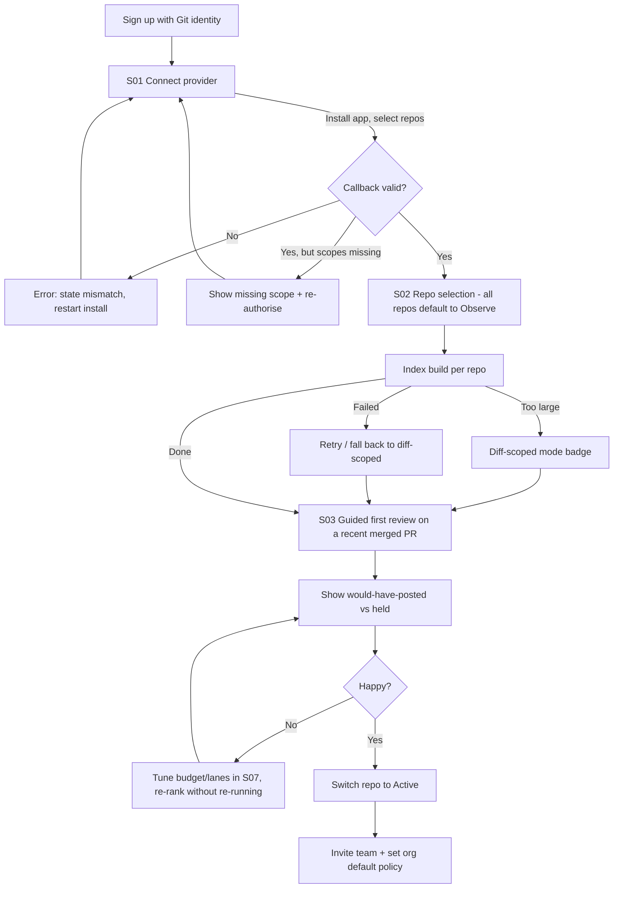
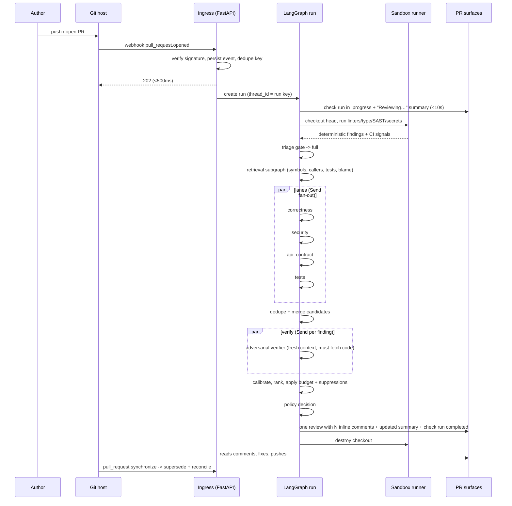
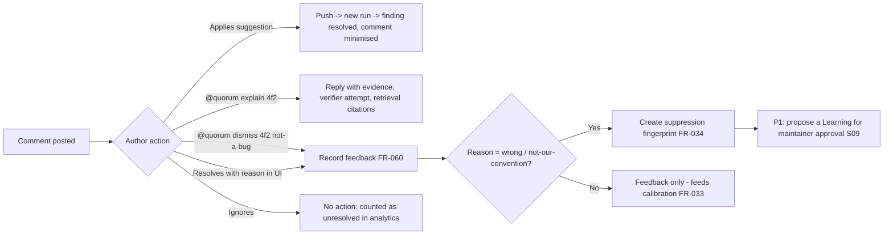
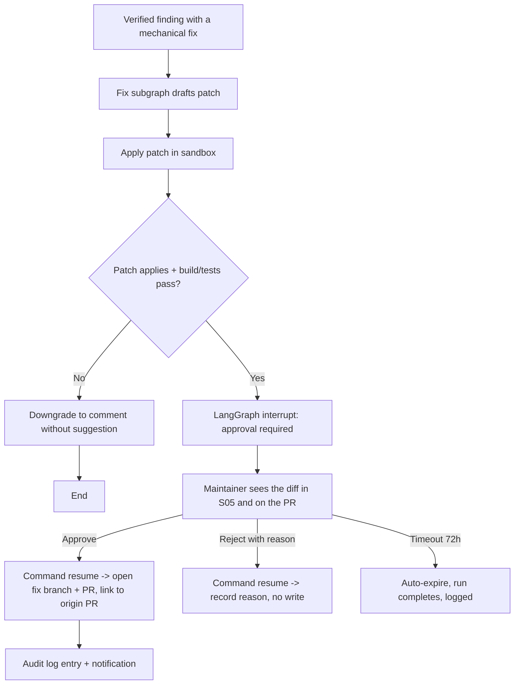
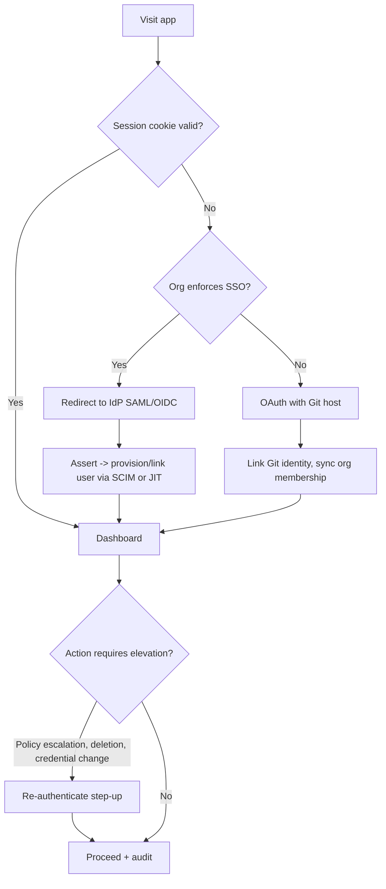
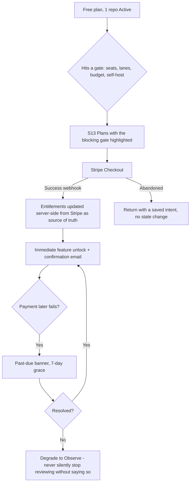
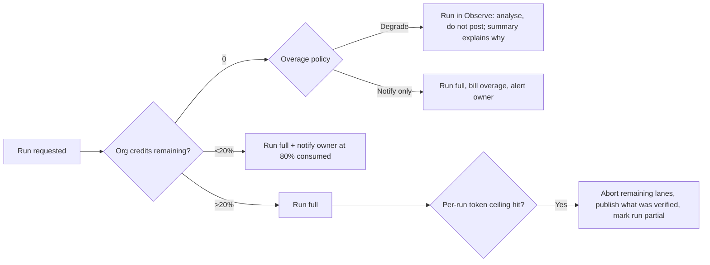
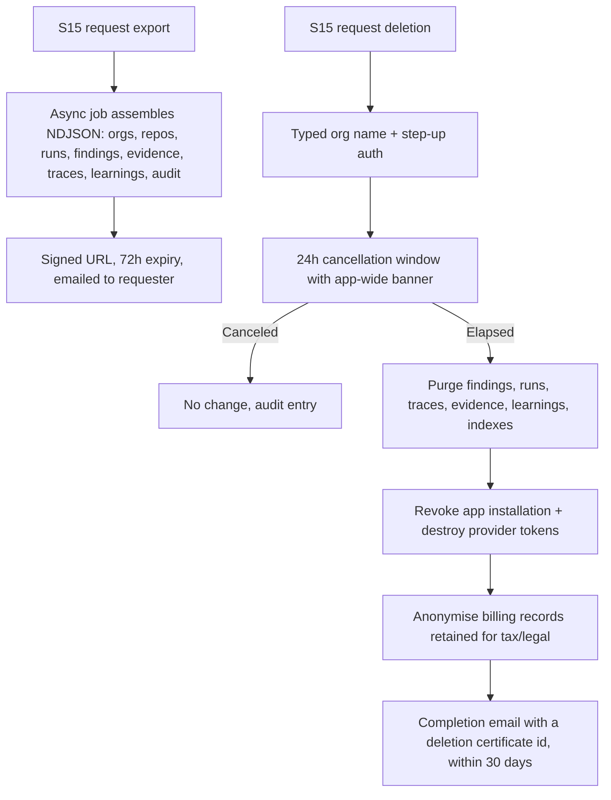

# 03 User Flows — Quorum

Mermaid diagrams below are the authoritative flow definitions. Screen ids refer to
`02_UX_SCREEN_SPEC.md`; requirement ids to `01_PRD.md`.

---

## 1. First run / onboarding (org admin)

**Exit criterion:** at least one repo in `Active` and one real PR reviewed.
**Recovery:** abandoning at any step leaves the org in a safe state — nothing posts until a repo
is explicitly Active (`FR-002`).

---

## 2. Primary happy path — a pull request is reviewed

---

## 3. Author responds — dismiss, explain, re-review

**Failure path:** if posting the reply fails (rate limit, permission revoked), the feedback is
still recorded and the reply is retried with backoff for up to 1 hour, then dropped with an
entry in the run's error log and a dashboard notice.

---

## 4. Auto-fix with human-in-the-loop (`FR-045`, P1)

Nothing is written to the repository without an explicit human decision recorded against a user
id. The graph is genuinely paused (state persisted at the checkpoint), so an approval days later
resumes the same run rather than starting a new one.

---

## 5. Authentication and session

Sessions: 12h idle / 30d absolute, rotating refresh, revocable per device from S17.
CLI uses device-code flow issuing a scoped token with a required expiry.

---

## 6. Purchase and plan change

Cancellation keeps data for the retention window with a visible countdown; downgrade never
deletes findings, it only disables features.

---

## 7. Budget and cost guardrail

---

## 8. Failure and recovery paths

| Failure | Detection | Behaviour | User-visible |
|---|---|---|---|
| Webhook delivery lost | Git host redelivery + 7-day event log | Replay from persisted event | None |
| Worker crash mid-run | Checkpointer heartbeat / lease expiry | Resume from last checkpoint; at most one node re-executed (`NFR-04`) | Run duration extends; timeline shows a resume marker |
| Model provider 5xx / timeout | Per-call timeout + retries with jitter | Retry ×2, then fall back to secondary provider, then degrade that lane | Summary lists the degraded lane |
| Model returns invalid JSON | Schema validation | One repair retry, then lane degrades | Same as above |
| Sandbox timeout | Hard wall clock | Kill, keep deterministic results, mark analyzers partial | Summary states analyzers were partial |
| Git host rate limit (incl. secondary) | 403/429 + headers | Exponential backoff honouring `Retry-After`; queue posts; never re-post duplicates | Comments arrive late; check run stays `in_progress` |
| Comment post partially fails | Per-comment result check | Retry failed subset only; summary reconciled | Summary lists comments that could not be anchored |
| Index stale/corrupt | Checksum + version | Rebuild in background, run in diff-scoped mode meanwhile | Badge on repo |
| Postgres failover | Connection errors | Runs pause, queue holds; resume on recovery | Banner in S16 |
| Prompt-injection attempt detected in repo content | Injection classifier | Findings from the affected context quarantined, run flagged, maintainer notified | Warning in summary + S05 banner |
| Run stuck >30 min | Watchdog | Cancel, publish partial, alert | Run marked `timed_out` with resume option |

---

## 9. Data export and deletion

---

## 10. Admin / moderation flows

- **Policy escalation:** enabling blocking checks, request-changes, approval, or auto-fix requires
  `owner`, a typed confirmation, and produces an audit entry plus an org-wide notification.
- **Emergency mute:** an `owner` can set the whole org to `observe` in one action from S16; it takes
  effect on in-flight runs at the publish node.
- **Runaway-rule containment:** a rule exceeding a 30% dismissal rate over 20 firings is auto-disabled
  and its author notified (`FR-025`).
- **Abuse containment:** a repo generating anomalous run volume (fork spam, PR churn) is rate-limited
  per installation, and the owner is told which repo tripped it.
