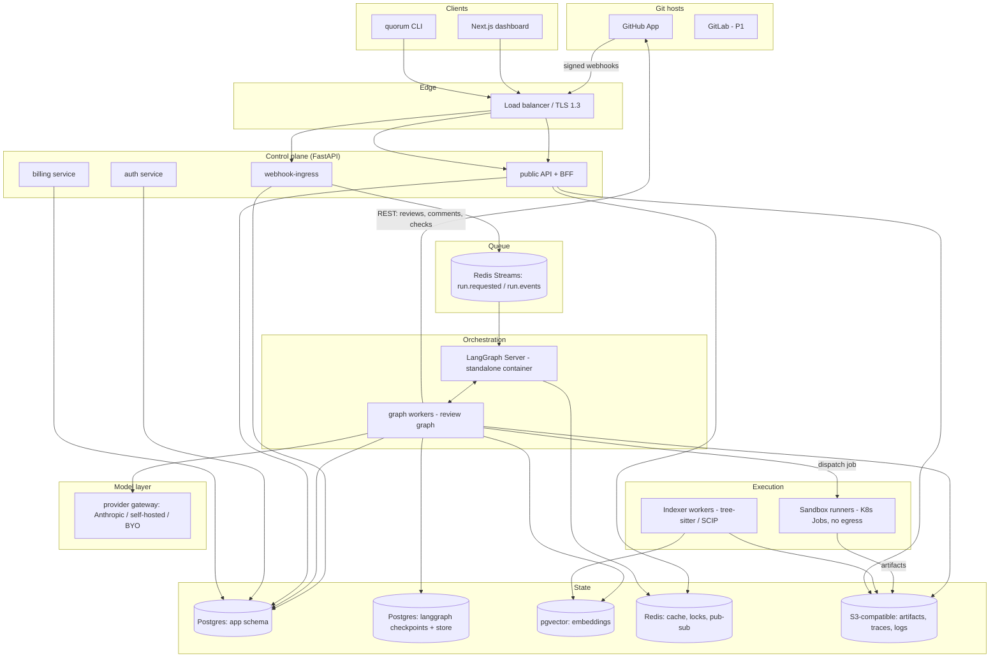
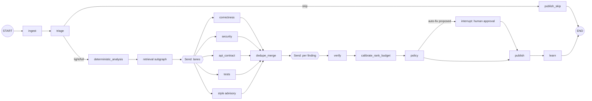

# 04 System Architecture — Quorum

Stack decisions here bind every other document. LangGraph API details are taken from the
LangChain documentation read on 2026-09-06 (`SOURCES.md` S10–S14); pin the exact `langgraph`
version at implementation time.

---

## 1. Architecture diagram

**Trust boundaries.** (1) Git host ↔ control plane: signed webhooks, short-lived installation
tokens. (2) Control plane ↔ sandbox: the sandbox receives code and a task, never long-lived
credentials or database access. (3) Workers ↔ model providers: the only egress path for repository
content, over TLS, with per-org provider configuration. Repository content never crosses an org
boundary — enforced by `org_id` scoping in every query plus a per-org namespace in object storage
and the vector index.

---

## 2. Services

| Service | Responsibility | Scale unit | Notes |
|---|---|---|---|
| `webhook-ingress` | Verify signature, persist raw event, dedupe, enqueue, ack <500ms | CPU, stateless | Must never call a model or the Git API inline |
| `api` | REST + BFF for the dashboard and CLI, SSE streaming of run events | CPU, stateless | Enforces authz and org scoping |
| `auth` | Sessions, OAuth/SSO, SCIM, API tokens, step-up | Stateless | |
| `billing` | Stripe webhooks, entitlements, metering rollups | Stateless | Stripe is entitlement source of truth |
| `langgraph-server` | Run lifecycle, threads, checkpoints, streaming, resume | Stateful via Postgres + Redis | Standalone container deployment (S13/S14) |
| `graph-worker` | Executes the review graph and subgraphs | Memory + provider concurrency | Horizontally scaled; per-org concurrency fairness |
| `runner` | Ephemeral sandbox: checkout, analyzers, patch application, test execution | K8s Job per run | No network egress except an allowlisted package proxy |
| `indexer` | Builds and incrementally updates symbol/embedding indexes | Batch | Triggered on enablement and on default-branch push |
| `scheduler` | Watchdogs, retention purges, calibration jobs, replay of dead-lettered events | Cron | |

---

## 3. The review graph (LangGraph)

Full node semantics, state schema and prompts live in `07_AI_OR_AUTOMATION_PIPELINE.md`. The
structural facts that matter architecturally:

- One `StateGraph` compiled with an `AsyncPostgresSaver` checkpointer and a LangGraph `Store`
  for cross-run memory (learnings, suppressions, calibration).
- `thread_id` = the run key `(repo_id, pr_number, head_sha, config_version, pipeline_version)`,
  so redelivered webhooks attach to the existing thread (`FR-011`).
- Executed with `durability="async"` by default: checkpoints are written while the next step
  runs, which is the right trade for minute-scale runs. `durability="sync"` is used for the
  publish and approval nodes, where a lost checkpoint could double-post or lose a human decision.
- Fan-out uses the `Send` API twice: once over lanes, once over findings for verification.
- Human approval uses `interrupt()`; the run resumes via `Command(resume=…)` when a decision
  arrives through the API (`FR-045`).
- Retrieval, each lane, verification, and fix drafting are **subgraphs**, so a lane can be
  developed, evaluated, and versioned independently, and third-party lanes become possible in P2.
- Streaming (`updates` + `custom` modes) drives the live timeline in S06 through Redis pub/sub
  and SSE.

**Node-level failure policy.** Every LLM node has a timeout, two retries with jittered backoff,
a schema-repair retry, and a documented degradation (lane dropped, run continues, summary
discloses). Non-LLM nodes are idempotent and safe to re-execute after a resume; the publish node
is made idempotent by reconciling against comments already carrying this run's fingerprint
markers rather than by assuming it has not run.

---

## 4. Sandbox execution

- One Kubernetes Job per run, image pinned by digest, rootless, read-only root filesystem,
  `seccomp`/`AppArmor` profiles, dropped capabilities, no service-account token mounted.
- Network policy: deny-all egress except a package-registry proxy for analyzer dependencies
  that are not pre-baked. No model calls from inside the sandbox — the worker owns provider access.
- Resource caps: default 4 vCPU, 8 GiB, 10-minute wall clock, 20 GiB ephemeral volume; per-plan
  overrides.
- Repository content is written to the ephemeral volume only. The volume is destroyed on job
  completion; the Job is `ttlSecondsAfterFinished: 0` with a sweeper for orphans (`FR-082`).
- Test execution for auto-fix verification runs in the same sandbox with the same egress denial;
  repos whose tests need network are detected and the fix is downgraded to a suggestion.

---

## 5. Retrieval and indexing

| Layer | Content | Store | Invalidation |
|---|---|---|---|
| Symbol index | tree-sitter parse → symbol table, definitions, references, imports | Postgres tables + object-storage shards | Default-branch push; per-file incremental |
| Graph edges | call/import/inheritance edges, plus SCIP/LSIF import when the repo publishes it | Postgres | Same |
| Text/semantic | chunked file embeddings | pgvector (HNSW) | Content-hash keyed; unchanged files reuse vectors |
| History | blame, recent PR touchpoints, past findings on the same lines | Postgres | Incremental |

Retrieval for a PR is diff-anchored: start from changed symbols, expand one hop through the graph,
then rank candidates with hybrid BM25 + vector scoring, and cut at a per-lane token budget. Every
retrieved chunk is recorded in state with `path`, `start_line`, `end_line`, and score, so the
evidence panel (S05) can show exactly what the model saw.

---

## 6. Data stores

- **Postgres (app):** orgs, repos, runs, findings, evidence, feedback, rules, learnings, policies,
  billing, audit. Row-level `org_id` on every table; the ORM layer refuses queries without an
  org predicate (enforced in tests).
- **Postgres (checkpoints):** LangGraph checkpointer and Store, separate database so retention,
  vacuum pressure, and restore semantics are independent of the app.
- **Redis:** run queue (Streams with consumer groups), distributed locks (one active run per PR),
  cache (diffs, provider responses keyed by prompt hash), pub/sub for SSE, rate-limiter counters.
  Required by LangGraph Server for streaming (S14).
- **Object storage:** analyzer outputs, full traces, evidence blobs, exports. Per-org prefix,
  server-side encryption, lifecycle rules matching the retention policy.

---

## 7. Integrations

| Integration | Direction | Notes |
|---|---|---|
| GitHub REST/GraphQL | out | Reviews (`POST …/pulls/{n}/reviews` with `event: COMMENT`), review comments with `path`/`line`/`side`/`start_line`, check runs, contents, compare. Honour primary and secondary rate limits (S5, S6) |
| GitHub webhooks | in | `pull_request`, `issue_comment`, `pull_request_review_comment`, `installation`, `push` |
| Model providers | out | Anthropic by default; OpenAI-compatible and self-hosted endpoints supported through the same interface. Provider configs carry a tier and a role, and the adaptive router (`07_AI_OR_AUTOMATION_PIPELINE.md` §7) picks among them per call |
| Stripe | both | Checkout, subscriptions, metered usage, webhooks |
| Slack / generic webhook | out | P1 notifications |
| OIDC/SAML IdP + SCIM | both | Enterprise plan |
| OpenTelemetry collector | out | Traces/metrics/logs |

---

## 8. Deployment and environments

| Environment | Purpose | Data |
|---|---|---|
| `dev` | Local `docker compose` (Postgres, Redis, MinIO, LangGraph Server, stub Git host) | Synthetic |
| `ci` | Ephemeral per-PR stack for integration and eval runs | Fixtures |
| `staging` | Mirrors production; reviews Quorum's own repositories | Real, internal only |
| `prod` | Kubernetes, multi-AZ, blue/green for the control plane | Customer |
| `self-hosted` | Helm chart + `docker compose` reference; standalone-container LangGraph Server | Customer-owned |

- **CI/CD:** GitHub Actions → lint, type-check, unit, integration, container build (SBOM +
  signature via cosign), migration dry-run, deploy to staging, eval-suite gate, manual promote.
- **Migrations:** expand/contract only; every migration is backward compatible with the previous
  app version so rollback never requires a down-migration.
- **Graph versioning:** `pipeline_version` is baked into the image and recorded on every run;
  in-flight runs finish on the version that started them (workers keep the previous image until
  drained).
- **Secrets:** external secret store (cloud KMS or Vault), mounted as files, rotated on schedule;
  customer model credentials are envelope-encrypted with a per-org data key.

---

## 9. Scalability and fairness

- Ingress is stateless and scales on request rate; workers scale on Redis Stream lag (KEDA).
- Per-org concurrency quota with weighted fair queueing so one monorepo cannot starve the fleet.
- Provider concurrency is governed by a token-bucket per provider per org; exhaustion queues
  rather than errors.
- Model routing is a per-call decision made by a pure function over recorded signals, with route
  plans cached by `(diff_hash, lane, pipeline_version, config_version)` so re-runs and replays
  reproduce the same tier decisions.
- Caching: identical `(prompt_hash, model, temperature=0)` calls are served from cache within
  24h; lane results are cached by `(diff_hash, lane, pipeline_version)` so a re-run after a
  config-only change reuses lane output and only re-verifies.
- Big-PR strategy is chunking with a risk-ranked attention budget (`FR-014`), never silent
  truncation.

---

## 10. Failure handling summary

| Class | Mechanism |
|---|---|
| Transient provider errors | Retry with jitter → secondary provider → lane degradation |
| Worker loss | Redis consumer-group claim + LangGraph resume from checkpoint |
| Poison events | 3 attempts → dead-letter stream → S16 replay tool |
| Duplicate publication | Fingerprint markers in comment bodies + reconciliation before posting |
| Runaway cost | Per-run token ceiling, per-org credit cap, circuit breaker per provider |
| Data-store outage | Ingress keeps accepting and persisting; runs pause; SLO alarm |
| Bad release | Blue/green + `pipeline_version` pinning + one-command rollback |

---

## 11. Observability

- **Traces:** OpenTelemetry spans per node, per tool call, per provider call, carrying
  `run_id`, `org_id`, `repo_id`, `node`, `lane`, `model`, `routed_tier`, `escalation_trigger`,
  `prompt_version`. Optional LangSmith
  export for prompt-level debugging (disabled by default on self-hosted).
- **Metrics:** queue lag, runs by state, node duration histograms, lane yield, verify
  confirm/refute ratio, posted-comment count, provider latency/error rate, tokens and cost per
  run, checkpoint write latency, sandbox failures.
- **Logs:** structured JSON, no code content above the evidence cap, secrets redacted at the
  formatter, correlation id on every line.
- **Dashboards and alerts:** see `12_ANALYTICS_AND_OBSERVABILITY.md`.
