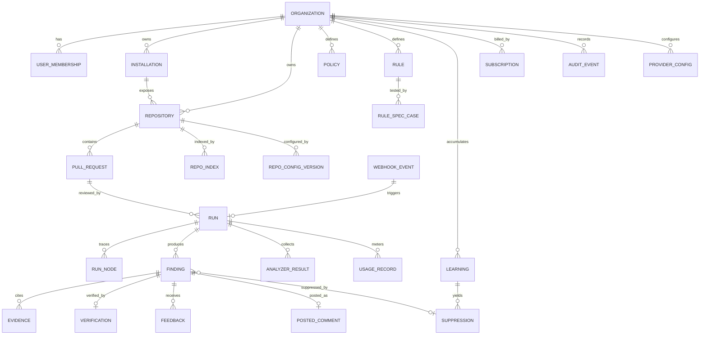

# 05 Data Model — Quorum

PostgreSQL 16. Every tenant-scoped table carries `org_id` and is protected by row-level security
in addition to application-layer scoping. Identifiers are UUIDv7 (time-ordered) unless noted.
Timestamps are `timestamptz`, stored UTC.

---

## 1. Entity overview



---

## 2. Core DDL

```sql
-- ---------- tenancy ----------
CREATE TABLE organization (
  id             uuid PRIMARY KEY,
  name           text NOT NULL,
  slug           citext NOT NULL UNIQUE,
  plan           text NOT NULL DEFAULT 'free',       -- free|team|business|enterprise
  credit_cap     integer NOT NULL DEFAULT 500,       -- credits per billing period
  overage_policy text NOT NULL DEFAULT 'degrade',    -- degrade|notify_only
  retention_days jsonb NOT NULL DEFAULT
      '{"traces":30,"evidence":90,"findings":365,"audit":730}'::jsonb,
  persist_excerpts boolean NOT NULL DEFAULT true,
  deletion_scheduled_at timestamptz,
  created_at     timestamptz NOT NULL DEFAULT now()
);

CREATE TABLE app_user (
  id            uuid PRIMARY KEY,
  email         citext NOT NULL UNIQUE,
  display_name  text,
  git_provider  text,                                -- github|gitlab|...
  git_user_id   text,
  last_seen_at  timestamptz,
  created_at    timestamptz NOT NULL DEFAULT now()
);

CREATE TABLE user_membership (
  org_id   uuid NOT NULL REFERENCES organization(id) ON DELETE CASCADE,
  user_id  uuid NOT NULL REFERENCES app_user(id) ON DELETE CASCADE,
  role     text NOT NULL CHECK (role IN ('owner','maintainer','member','auditor')),
  created_at timestamptz NOT NULL DEFAULT now(),
  PRIMARY KEY (org_id, user_id)
);

-- ---------- git host ----------
CREATE TABLE installation (
  id              uuid PRIMARY KEY,
  org_id          uuid NOT NULL REFERENCES organization(id) ON DELETE CASCADE,
  provider        text NOT NULL,                     -- github|gitlab|azure|bitbucket
  external_id     text NOT NULL,
  account_login   text NOT NULL,
  scopes          text[] NOT NULL,
  status          text NOT NULL DEFAULT 'active',    -- active|suspended|revoked
  installed_at    timestamptz NOT NULL DEFAULT now(),
  UNIQUE (provider, external_id)
);

CREATE TABLE repository (
  id                uuid PRIMARY KEY,
  org_id            uuid NOT NULL REFERENCES organization(id) ON DELETE CASCADE,
  installation_id   uuid NOT NULL REFERENCES installation(id) ON DELETE CASCADE,
  provider          text NOT NULL,
  external_id       text NOT NULL,
  full_name         text NOT NULL,                   -- owner/name
  default_branch    text NOT NULL DEFAULT 'main',
  primary_language  text,
  size_kb           bigint,
  state             text NOT NULL DEFAULT 'observe'  -- disabled|observe|active
                    CHECK (state IN ('disabled','observe','active')),
  retrieval_mode    text NOT NULL DEFAULT 'indexed', -- indexed|diff_scoped
  created_at        timestamptz NOT NULL DEFAULT now(),
  UNIQUE (provider, external_id)
);

CREATE TABLE repo_config_version (
  id           uuid PRIMARY KEY,
  org_id       uuid NOT NULL,
  repo_id      uuid NOT NULL REFERENCES repository(id) ON DELETE CASCADE,
  version      integer NOT NULL,
  source       text NOT NULL CHECK (source IN ('default','org','ui','file')),
  effective    jsonb NOT NULL,     -- fully merged config actually used
  raw_file     text,               -- .quorum.yaml as read, when source='file'
  valid        boolean NOT NULL DEFAULT true,
  validation_errors jsonb,
  created_at   timestamptz NOT NULL DEFAULT now(),
  UNIQUE (repo_id, version)
);

CREATE TABLE policy (
  id                    uuid PRIMARY KEY,
  org_id                uuid NOT NULL REFERENCES organization(id) ON DELETE CASCADE,
  repo_id               uuid REFERENCES repository(id) ON DELETE CASCADE, -- null = org default
  version               integer NOT NULL,
  comment_budget        smallint NOT NULL DEFAULT 8 CHECK (comment_budget BETWEEN 1 AND 25),
  min_post_severity     text NOT NULL DEFAULT 'medium',
  blocking_severity     text,                       -- null = never fail the check run
  may_request_changes   boolean NOT NULL DEFAULT false,
  may_approve           boolean NOT NULL DEFAULT false,
  autofix_mode          text NOT NULL DEFAULT 'off' CHECK (autofix_mode IN ('off','suggest','pr_with_approval')),
  enabled_lanes         text[] NOT NULL DEFAULT ARRAY['correctness','security','api_contract','tests'],
  created_by            uuid REFERENCES app_user(id),
  created_at            timestamptz NOT NULL DEFAULT now(),
  UNIQUE (org_id, repo_id, version)
);

-- ---------- work ----------
CREATE TABLE webhook_event (
  id            uuid PRIMARY KEY,
  org_id        uuid,
  provider      text NOT NULL,
  delivery_id   text NOT NULL,
  event_type    text NOT NULL,
  payload       jsonb NOT NULL,
  signature_ok  boolean NOT NULL,
  received_at   timestamptz NOT NULL DEFAULT now(),
  processed_at  timestamptz,
  attempts      smallint NOT NULL DEFAULT 0,
  dead_lettered boolean NOT NULL DEFAULT false,
  UNIQUE (provider, delivery_id)
);

CREATE TABLE pull_request (
  id            uuid PRIMARY KEY,
  org_id        uuid NOT NULL,
  repo_id       uuid NOT NULL REFERENCES repository(id) ON DELETE CASCADE,
  number        integer NOT NULL,
  title         text,
  author_login  text,
  author_is_bot boolean NOT NULL DEFAULT false,
  base_branch   text,
  head_branch   text,
  state         text,                                -- open|closed|merged
  draft         boolean NOT NULL DEFAULT false,
  opened_at     timestamptz,
  UNIQUE (repo_id, number)
);

CREATE TABLE run (
  id                uuid PRIMARY KEY,
  org_id            uuid NOT NULL,
  repo_id           uuid NOT NULL REFERENCES repository(id) ON DELETE CASCADE,
  pull_request_id   uuid NOT NULL REFERENCES pull_request(id) ON DELETE CASCADE,
  run_key           text NOT NULL,   -- repo:pr:head_sha:config_version:pipeline_version
  thread_id         text NOT NULL,   -- LangGraph thread id (== run_key)
  head_sha          char(40) NOT NULL,
  base_sha          char(40),
  trigger           text NOT NULL,   -- pr_opened|pr_synchronize|command|manual|scheduled
  mode              text NOT NULL,   -- full|light|skip|observe
  state             text NOT NULL,   -- queued|running|awaiting_human|completed|partial|failed|canceled|superseded|timed_out
  triage_reason     text,
  pipeline_version  text NOT NULL,
  config_version    integer NOT NULL,
  policy_version    integer NOT NULL,
  lanes_run         text[] NOT NULL DEFAULT '{}',
  lanes_degraded    text[] NOT NULL DEFAULT '{}',
  changed_files     integer,
  changed_lines     integer,
  files_deep        integer,
  files_skimmed     integer,
  posted_count      smallint NOT NULL DEFAULT 0,
  held_count        smallint NOT NULL DEFAULT 0,
  suppressed_count  smallint NOT NULL DEFAULT 0,
  credits           numeric(10,3) NOT NULL DEFAULT 0,
  cost_usd          numeric(10,4) NOT NULL DEFAULT 0,
  tokens_in         bigint NOT NULL DEFAULT 0,
  tokens_out        bigint NOT NULL DEFAULT 0,
  escalations       smallint NOT NULL DEFAULT 0,
  route_plan_hash   text,               -- reused verbatim on a re-run of the same run key
  routing_savings_usd numeric(10,4) NOT NULL DEFAULT 0,  -- vs an all-strong-tier baseline
  error             jsonb,
  started_at        timestamptz,
  first_comment_at  timestamptz,
  finished_at       timestamptz,
  created_at        timestamptz NOT NULL DEFAULT now(),
  UNIQUE (run_key)
);

CREATE TABLE run_node (
  id            uuid PRIMARY KEY,
  org_id        uuid NOT NULL,
  run_id        uuid NOT NULL REFERENCES run(id) ON DELETE CASCADE,
  node          text NOT NULL,          -- ingest|triage|lane:security|verify|publish|...
  task_key      text,                   -- Send-branch discriminator (lane name / finding id)
  status        text NOT NULL,          -- ok|degraded|failed|skipped
  attempt       smallint NOT NULL DEFAULT 1,
  model         text,
  prompt_id     text,
  prompt_version text,
  tokens_in     integer,
  tokens_out    integer,
  cost_usd      numeric(10,4),
  duration_ms   integer,
  checkpoint_id text,
  routed_tier   smallint,               -- tier the router chose for this call
  route_reason  text,                   -- risk_high|lane_floor|low_yield|budget_low|latency_low|...
  escalated_from text,                  -- model this call was retried from, null when not escalated
  escalation_trigger text,              -- self_request|schema_repair|ambiguous_confidence|unprovable|lane_disagreement|sensitive_path_silent
  payload_uri   text,                   -- object storage; redacted before write
  error         jsonb,
  started_at    timestamptz,
  finished_at   timestamptz
);

CREATE TABLE analyzer_result (
  id          uuid PRIMARY KEY,
  org_id      uuid NOT NULL,
  run_id      uuid NOT NULL REFERENCES run(id) ON DELETE CASCADE,
  analyzer    text NOT NULL,           -- ruff|eslint|mypy|semgrep|gitleaks|pytest|ci_check
  version     text,
  status      text NOT NULL,           -- ok|failed|timeout|skipped
  duration_ms integer,
  summary     jsonb,                   -- counts by severity
  raw_uri     text                     -- SARIF/JSON in object storage
);

-- ---------- findings ----------
CREATE TABLE finding (
  id                   uuid PRIMARY KEY,
  org_id               uuid NOT NULL,
  run_id               uuid NOT NULL REFERENCES run(id) ON DELETE CASCADE,
  repo_id              uuid NOT NULL,
  fingerprint          text NOT NULL,  -- stable across runs: repo + normalized claim + code hash
  lane                 text NOT NULL,
  category             text NOT NULL,  -- logic_error|null_deref|race|injection|authz|perf|api_break|test_gap|migration|style|...
  severity             text NOT NULL CHECK (severity IN ('critical','high','medium','low','info')),
  title                text NOT NULL,
  claim                text NOT NULL,  -- one sentence, machine-checkable phrasing
  rationale            text NOT NULL,
  file_path            text,
  start_line           integer,
  end_line             integer,
  side                 text DEFAULT 'RIGHT',
  suggested_patch      text,
  evidence_classes     text[] NOT NULL DEFAULT '{}',
  raw_confidence       numeric(4,3),
  calibrated_confidence numeric(4,3),
  blast_radius         numeric(4,3),
  rank_score           numeric(8,4),
  status               text NOT NULL,  -- candidate|refuted|unprovable|confirmed|suppressed|held|posted|resolved|withdrawn
  suppressed_by        uuid,           -- suppression.id
  rule_id              uuid,
  created_at           timestamptz NOT NULL DEFAULT now()
);

CREATE TABLE evidence (
  id          uuid PRIMARY KEY,
  org_id      uuid NOT NULL,
  finding_id  uuid NOT NULL REFERENCES finding(id) ON DELETE CASCADE,
  class       text NOT NULL CHECK (class IN
              ('static_tool','test_failure','symbol_resolution','spec_violation','reproduction','heuristic')),
  source      text NOT NULL,           -- analyzer name, tool call, retrieval id
  file_path   text,
  start_line  integer,
  end_line    integer,
  excerpt     text,                    -- capped (default 40 lines), secret-redacted, null if persist_excerpts=false
  detail      jsonb,
  created_at  timestamptz NOT NULL DEFAULT now()
);

CREATE TABLE verification (
  id                  uuid PRIMARY KEY,
  org_id              uuid NOT NULL,
  finding_id          uuid NOT NULL UNIQUE REFERENCES finding(id) ON DELETE CASCADE,
  verdict             text NOT NULL CHECK (verdict IN ('confirmed','refuted','unprovable')),
  refutation_attempt  text NOT NULL,
  counter_evidence    jsonb,
  verifier_model      text,
  verifier_prompt_version text,
  confidence          numeric(4,3),
  tool_calls          jsonb,
  duration_ms         integer,
  created_at          timestamptz NOT NULL DEFAULT now()
);

CREATE TABLE posted_comment (
  id                 uuid PRIMARY KEY,
  org_id             uuid NOT NULL,
  finding_id         uuid NOT NULL REFERENCES finding(id) ON DELETE CASCADE,
  run_id             uuid NOT NULL REFERENCES run(id) ON DELETE CASCADE,
  provider_comment_id text,
  provider_review_id  text,
  body_hash          text NOT NULL,
  anchored_path      text,
  anchored_line      integer,
  state              text NOT NULL,   -- posted|updated|minimized|withdrawn|failed
  posted_at          timestamptz,
  error              jsonb
);

CREATE TABLE feedback (
  id           uuid PRIMARY KEY,
  org_id       uuid NOT NULL,
  finding_id   uuid NOT NULL REFERENCES finding(id) ON DELETE CASCADE,
  fingerprint  text NOT NULL,
  actor_user_id uuid REFERENCES app_user(id),
  actor_login  text,
  signal       text NOT NULL CHECK (signal IN
               ('fixed','useful_not_fixed','not_a_bug','wrong','out_of_scope','not_our_convention','duplicate','unclear','reaction_positive','reaction_negative')),
  note         text,
  source       text NOT NULL,        -- pr_command|pr_resolution|dashboard|reaction
  created_at   timestamptz NOT NULL DEFAULT now()
);

-- ---------- knowledge ----------
CREATE TABLE rule (
  id          uuid PRIMARY KEY,
  org_id      uuid NOT NULL REFERENCES organization(id) ON DELETE CASCADE,
  repo_id     uuid REFERENCES repository(id) ON DELETE CASCADE,
  name        text NOT NULL,
  statement   text NOT NULL,
  path_globs  text[] NOT NULL DEFAULT '{}',
  severity    text NOT NULL DEFAULT 'medium',
  status      text NOT NULL DEFAULT 'draft',  -- draft|spec_failing|enabled|disabled|auto_disabled
  hit_count   integer NOT NULL DEFAULT 0,
  dismiss_count integer NOT NULL DEFAULT 0,
  created_by  uuid REFERENCES app_user(id),
  created_at  timestamptz NOT NULL DEFAULT now()
);

CREATE TABLE rule_spec_case (
  id        uuid PRIMARY KEY,
  org_id    uuid NOT NULL,
  rule_id   uuid NOT NULL REFERENCES rule(id) ON DELETE CASCADE,
  kind      text NOT NULL CHECK (kind IN ('should_flag','should_not_flag')),
  language  text,
  code      text NOT NULL,
  last_result text,                  -- pass|fail|error
  last_run_at timestamptz
);

CREATE TABLE learning (
  id            uuid PRIMARY KEY,
  org_id        uuid NOT NULL REFERENCES organization(id) ON DELETE CASCADE,
  repo_id       uuid REFERENCES repository(id) ON DELETE CASCADE,
  statement     text NOT NULL,
  scope_globs   text[] NOT NULL DEFAULT '{}',
  origin_finding_id uuid,
  effect        text NOT NULL DEFAULT 'suppress' CHECK (effect IN ('suppress','downrank')),
  status        text NOT NULL DEFAULT 'active',
  use_count     integer NOT NULL DEFAULT 0,
  last_used_at  timestamptz,
  created_by    uuid REFERENCES app_user(id),
  created_at    timestamptz NOT NULL DEFAULT now()
);

CREATE TABLE suppression (
  id           uuid PRIMARY KEY,
  org_id       uuid NOT NULL,
  repo_id      uuid REFERENCES repository(id) ON DELETE CASCADE,
  kind         text NOT NULL CHECK (kind IN ('fingerprint','rule','path','category')),
  value        text NOT NULL,
  learning_id  uuid REFERENCES learning(id) ON DELETE CASCADE,
  expires_at   timestamptz,
  created_by   uuid REFERENCES app_user(id),
  created_at   timestamptz NOT NULL DEFAULT now()
);

CREATE TABLE calibration (
  org_id       uuid NOT NULL,
  repo_id      uuid,
  lane         text NOT NULL,
  category     text NOT NULL,
  samples      integer NOT NULL DEFAULT 0,
  accepted     integer NOT NULL DEFAULT 0,
  a            numeric(6,4) NOT NULL DEFAULT 1,   -- Platt scaling parameters
  b            numeric(6,4) NOT NULL DEFAULT 0,
  updated_at   timestamptz NOT NULL DEFAULT now(),
  PRIMARY KEY (org_id, repo_id, lane, category)
);

-- ---------- index ----------
CREATE TABLE repo_index (
  id             uuid PRIMARY KEY,
  org_id         uuid NOT NULL,
  repo_id        uuid NOT NULL REFERENCES repository(id) ON DELETE CASCADE,
  commit_sha     char(40) NOT NULL,
  status         text NOT NULL,    -- building|ready|stale|failed
  files_indexed  integer,
  symbols        integer,
  built_at       timestamptz,
  error          jsonb
);

CREATE TABLE code_chunk (
  id          uuid PRIMARY KEY,
  org_id      uuid NOT NULL,
  repo_id     uuid NOT NULL REFERENCES repository(id) ON DELETE CASCADE,
  file_path   text NOT NULL,
  start_line  integer NOT NULL,
  end_line    integer NOT NULL,
  symbol      text,
  content_hash text NOT NULL,
  embedding   vector(1024)
);

CREATE TABLE symbol_edge (
  org_id     uuid NOT NULL,
  repo_id    uuid NOT NULL REFERENCES repository(id) ON DELETE CASCADE,
  from_symbol text NOT NULL,
  to_symbol   text NOT NULL,
  edge_type   text NOT NULL,     -- calls|imports|inherits|implements|tests
  file_path   text,
  line        integer
);

-- ---------- commerce, security, config ----------
CREATE TABLE subscription (
  id                 uuid PRIMARY KEY,
  org_id             uuid NOT NULL UNIQUE REFERENCES organization(id) ON DELETE CASCADE,
  stripe_customer_id text,
  stripe_subscription_id text,
  plan               text NOT NULL,
  seats              integer NOT NULL DEFAULT 1,
  status             text NOT NULL,  -- trialing|active|past_due|canceled
  period_start       timestamptz,
  period_end         timestamptz
);

CREATE TABLE usage_record (
  id          uuid PRIMARY KEY,
  org_id      uuid NOT NULL,
  run_id      uuid REFERENCES run(id) ON DELETE SET NULL,
  period      date NOT NULL,
  credits     numeric(10,3) NOT NULL,
  cost_usd    numeric(10,4) NOT NULL,
  reported_to_stripe boolean NOT NULL DEFAULT false,
  created_at  timestamptz NOT NULL DEFAULT now()
);

CREATE TABLE provider_config (
  id            uuid PRIMARY KEY,
  org_id        uuid NOT NULL REFERENCES organization(id) ON DELETE CASCADE,
  node_class    text NOT NULL CHECK (node_class IN ('triage','lane','verify','summarise','embed')),
  provider      text NOT NULL,
  model         text NOT NULL,
  base_url      text,
  max_tokens    integer,
  temperature   numeric(3,2) NOT NULL DEFAULT 0,
  credential_ref text,               -- pointer into the secret store, never the secret
  tier          smallint NOT NULL DEFAULT 2 CHECK (tier BETWEEN 1 AND 3),  -- 1 cheap, 2 mid, 3 strong
  role          text NOT NULL DEFAULT 'primary'
                CHECK (role IN ('primary','escalation','fallback','floor')),
  fallback_of   uuid REFERENCES provider_config(id),
  UNIQUE (org_id, node_class, role, fallback_of)
);

CREATE TABLE audit_event (
  id          uuid PRIMARY KEY,
  org_id      uuid NOT NULL,
  actor_user_id uuid,
  actor_type  text NOT NULL,   -- user|system|api_token
  action      text NOT NULL,   -- policy.updated|comment.posted|export.requested|...
  target_type text,
  target_id   text,
  ip          inet,
  metadata    jsonb,
  created_at  timestamptz NOT NULL DEFAULT now()
);
```

---

## 3. Indexes

```sql
CREATE INDEX run_org_created_idx        ON run (org_id, created_at DESC);
CREATE INDEX run_repo_pr_idx            ON run (repo_id, pull_request_id, created_at DESC);
CREATE INDEX run_state_idx              ON run (state) WHERE state IN ('queued','running','awaiting_human');
CREATE INDEX run_node_run_idx           ON run_node (run_id, started_at);
CREATE INDEX run_node_escalation_idx    ON run_node (org_id, escalation_trigger) WHERE escalated_from IS NOT NULL;
CREATE INDEX finding_run_idx            ON finding (run_id, status);
CREATE INDEX finding_fingerprint_idx    ON finding (repo_id, fingerprint);
CREATE INDEX finding_rank_idx           ON finding (run_id, rank_score DESC) WHERE status IN ('confirmed','posted','held');
CREATE INDEX evidence_finding_idx       ON evidence (finding_id);
CREATE INDEX feedback_fingerprint_idx   ON feedback (org_id, fingerprint, created_at DESC);
CREATE INDEX suppression_lookup_idx     ON suppression (org_id, repo_id, kind, value) WHERE expires_at IS NULL OR expires_at > now();
CREATE INDEX webhook_unprocessed_idx    ON webhook_event (received_at) WHERE processed_at IS NULL AND NOT dead_lettered;
CREATE INDEX audit_org_time_idx         ON audit_event (org_id, created_at DESC);
CREATE INDEX usage_period_idx           ON usage_record (org_id, period);
CREATE INDEX chunk_repo_path_idx        ON code_chunk (repo_id, file_path);
CREATE INDEX chunk_embedding_idx        ON code_chunk USING hnsw (embedding vector_cosine_ops);
CREATE INDEX symbol_edge_from_idx       ON symbol_edge (repo_id, from_symbol);
CREATE INDEX symbol_edge_to_idx         ON symbol_edge (repo_id, to_symbol);
```

Partitioning: `run`, `run_node`, `finding`, `evidence`, `audit_event`, and `webhook_event` are
range-partitioned monthly on `created_at`. Retention is then a partition drop rather than a
mass delete.

---

## 4. Ownership and storage location

| Data | Owner | Store | Notes |
|---|---|---|---|
| Repository working tree | customer | sandbox ephemeral volume | destroyed at run end (`FR-082`) |
| Diff and file contents used in a run | customer | in-memory + object storage under run prefix | deleted with the trace |
| Evidence excerpts | customer | Postgres, capped and redacted | `persist_excerpts=false` stores `null` |
| Graph state / checkpoints | Quorum | separate Postgres database | purged with trace retention |
| Embeddings | derived | pgvector | deleted on repo disable |
| Findings, feedback, learnings | shared | Postgres | survive index deletion; deleted on org deletion |
| Model credentials | customer | external secret store | database holds only `credential_ref` |
| Routing policy | shared | inside `repo_config_version.effective` | versioned with the config, so a change invalidates route plans and lane caches |
| Route plans | derived | Redis, keyed by `(diff_hash, lane, pipeline_version, config_version)` | 7 days, matching the lane result cache |
| Billing records | Quorum | Postgres + Stripe | retained for statutory period after deletion, anonymised |

---

## 5. Retention defaults

| Data class | Default | Configurable range |
|---|---|---|
| Node payload traces (object storage) | 30 days | 1–180 |
| Evidence excerpts | 90 days | 0–365 |
| Findings and runs (metadata) | 365 days | 90–1095 |
| Webhook raw payloads | 7 days | 1–30 |
| Audit events | 730 days | 365–2555 |
| Learnings, rules, suppressions | until deleted | — |
| Checkpoints for completed runs | 30 days | tied to trace retention |
| Checkpoints for `awaiting_human` runs | 90 days or until resolved | — |

A nightly `scheduler` job drops expired partitions, deletes object-storage prefixes by lifecycle
rule, and vacuums the checkpoint database.

---

## 6. Typed models (application layer)

```python
class Severity(StrEnum):
    critical = "critical"; high = "high"; medium = "medium"; low = "low"; info = "info"

class EvidenceClass(StrEnum):
    static_tool = "static_tool"; test_failure = "test_failure"
    symbol_resolution = "symbol_resolution"; spec_violation = "spec_violation"
    reproduction = "reproduction"; heuristic = "heuristic"

class EvidenceItem(BaseModel):
    cls: EvidenceClass
    source: str
    file_path: str | None = None
    start_line: int | None = None
    end_line: int | None = None
    excerpt: str | None = None          # capped at 40 lines before persistence
    detail: dict[str, Any] = {}

class Finding(BaseModel):
    id: UUID
    lane: str
    category: str
    severity: Severity
    title: str                          # <= 80 chars
    claim: str                          # one falsifiable sentence
    rationale: str
    file_path: str | None
    start_line: int | None
    end_line: int | None
    evidence: list[EvidenceItem]
    suggested_patch: str | None = None
    raw_confidence: float               # 0..1
    fingerprint: str

class Verification(BaseModel):
    verdict: Literal["confirmed", "refuted", "unprovable"]
    refutation_attempt: str             # required, non-empty
    counter_evidence: list[EvidenceItem] = []
    confidence: float
```

`fingerprint = sha256(repo_id | category | normalized_claim | sha256(surrounding_code_window))`,
so the same defect on the same code recurs with a stable id even if line numbers shift.

---

## 7. Migrations

- Alembic, one migration per PR, expand/contract discipline: add nullable → backfill in batches →
  switch reads → drop in a later release. No migration blocks longer than 5 seconds on a table
  over 10M rows; long backfills run as scheduler jobs.
- All migrations are tested against a production-shaped seeded database in CI, forward and
  rolled back to the previous release's app version.
- LangGraph checkpoint schema is owned by the library; it is created by the library's own setup
  routine and never hand-edited. Upgrading `langgraph` runs its migration in a maintenance
  window with drained workers, because in-flight checkpoints must not be read by two versions.
- `pipeline_version` is not a migration concern: old runs keep their recorded version and are
  never re-interpreted under new semantics.
