# 07 AI Pipeline — the Quorum review graph (LangGraph)

This document is the specification of the product's core. Prompts live in
`19_PROMPT_LIBRARY.md`; evals in `13_TEST_PLAN.md`. API names follow the LangGraph
documentation read 2026-09-06 (`SOURCES.md` S10–S14) — pin the package version before coding.

---

## 1. Design principles

1. **Deterministic first.** Anything a compiler, linter, type checker, scanner, or test can
   decide is decided that way. Models are only asked questions that require judgement.
2. **A finding is a hypothesis.** It is not review output until a separate agent has tried and
   failed to refute it.
3. **Every claim cites code.** File and line spans that resolve at the head SHA, or the finding
   is dropped.
4. **Silence is a valid output** and must be explainable: the summary always says what was checked.
5. **The graph is the product's memory.** Checkpoints make runs durable, resumable, replayable
   and auditable — not an afterthought bolted on for reliability.
6. **Untrusted input.** Repository content, PR text, and comments are data. Instructions inside
   them are never followed (§10).

---

## 2. Graph topology

```mermaid
flowchart TB
    START((START)) --> ingest
    ingest --> triage
    triage -->|skip| publish_skip --> END((END))
    triage -->|light| deterministic
    triage -->|full| deterministic
    deterministic --> retrieval[[retrieval subgraph]]
    retrieval --> lane_fanout{{Send per enabled lane}}
    lane_fanout --> correctness[[lane subgraph: correctness]]
    lane_fanout --> security[[lane subgraph: security]]
    lane_fanout --> api_contract[[lane subgraph: api_contract]]
    lane_fanout --> tests[[lane subgraph: tests]]
    lane_fanout --> performance[[lane: performance - P1]]
    lane_fanout --> lane_style[["lane: style - advisory"]]
    correctness --> merge
    security --> merge
    api_contract --> merge
    tests --> merge
    performance --> merge
    lane_style --> merge
    merge[dedupe_merge] --> verify_fanout{{Send per candidate finding}}
    verify_fanout --> verify[[verify subgraph]]
    verify --> rank[calibrate_rank_budget]
    rank --> policy
    policy -->|autofix proposed| fix[[fix subgraph]]
    fix --> approval[interrupt: human approval]
    approval --> publish
    policy --> publish
    publish --> learn
    learn --> END
```



---

## 3. State

```python
from typing import Annotated, Literal, TypedDict
from operator import add

def merge_findings(left: list[Finding], right: list[Finding]) -> list[Finding]:
    """Reducer for concurrent lane writes: append, then keep the strongest duplicate."""
    return dedupe_by_fingerprint(left + right)

class ReviewState(TypedDict, total=False):
    # immutable run identity
    run_id: str
    org_id: str
    repo_id: str
    pr_number: int
    head_sha: str
    base_sha: str
    pipeline_version: str
    config: RepoConfig            # frozen at ingest
    policy: Policy                # frozen at ingest

    # inputs
    diff: DiffSummary             # per-file hunks, language, size, risk score
    pr_meta: PRMeta               # title, body (sanitised), labels, author_is_bot
    ci_signals: list[CheckResult]

    # stage outputs
    triage: TriageDecision        # mode, reason, attention_budget, chunk plan
    analyzers: Annotated[list[AnalyzerResult], add]
    context: RetrievedContext     # chunks with path/line/score, symbol graph slice
    candidates: Annotated[list[Finding], merge_findings]
    verifications: Annotated[dict[str, Verification], merge_dicts]
    ranked: list[Finding]
    posted: list[PostedComment]

    # control
    lanes_run: Annotated[list[str], add]
    lanes_degraded: Annotated[list[str], add]
    errors: Annotated[list[NodeError], add]
    cost: Annotated[CostAccumulator, add_cost]   # tokens + usd, per node
    awaiting: Literal["autofix", "blocking_publish"] | None
```

Reducers matter: lanes and verifiers run concurrently under `Send`, so every field written by
more than one branch is `Annotated` with an explicit combiner. Fields written by exactly one node
(`triage`, `ranked`) use last-write semantics.

---

## 4. Nodes

### `ingest`
Loads repo config (`.quorum.yaml` merged over UI over org defaults), freezes `config` and
`policy` versions into state, fetches PR metadata and the diff, sanitises PR text (§10), and posts
the in-progress summary and check run within 10 seconds. No model call.

### `triage` — model: cheap tier (Claude Haiku 4.5 default)
Inputs: file paths, sizes, languages, labels, author type, changed-line counts, and analyzer
availability. Output (strict JSON):

```json
{"mode":"full","reason":"api surface changed in 3 services",
 "attention_budget_lines":1500,"chunks":[{"files":["payments/refund.py"],"risk":0.91}],
 "skip_paths":["package-lock.json"]}
```

Deterministic guards override the model: lockfile/generated/vendored-only diffs are `skip`
regardless of model output; diffs touching declared security-sensitive paths are never `skip`.

### `deterministic` — no model
Dispatches the sandbox job: checkout at head, resolve merge-base, run the configured analyzer set
(linters, type checkers, `semgrep`, secret scanning, dependency audit), run impacted tests when
the repo declares a fast test command, and pull existing CI check results. Emits
`AnalyzerResult[]` with SARIF where available. Failures degrade to `status: failed` for that
analyzer and never abort the run.

### `retrieval` (subgraph) — embedding model + no reasoning model
For each changed symbol: definition, direct callers/callees, implementing/overriding symbols,
tests referencing it, and the last 3 PRs that touched the same lines. Hybrid BM25 + vector rank,
one-hop graph expansion, per-lane token budget (default 24k). Emits `RetrievedContext` where every
chunk records `path`, `start_line`, `end_line`, `retrieval_reason`, and `score` — this list is
what the evidence panel shows.

### Lane subgraph (parameterised, one instance per lane) — model: mid tier (Claude Sonnet 5 default)
Internal steps: `focus` (select the hunks this lane cares about) → `reason` (produce candidate
findings) → `self_check` (drop findings without a citable line span or without a falsifiable
claim) → `emit`. Each lane has its own prompt, its own output schema constraints, and its own
severity ceiling from policy.

| Lane | Looks for | Must cite |
|---|---|---|
| `correctness` | logic errors, null/None paths, off-by-one, error-handling gaps, state mutation bugs, resource leaks | the code path that reaches the defect |
| `security` | injection, authz gaps, unsafe deserialization, secret handling, SSRF, path traversal, crypto misuse | the source→sink path or the missing check |
| `api_contract` | breaking public API/schema/migration changes, incompatible serialisation, missing versioning | the consumer or spec that breaks |
| `tests` | untested changed branches, tests asserting nothing, tests weakened alongside a behaviour change | the changed branch and the absent/weak test |
| `performance` (P1) | N+1 queries, unbounded loops over network calls, quadratic paths on request handlers | the call site and the loop/query |
| `data_migration` (P1) | destructive or non-reversible migrations, missing backfill, lock-taking DDL on large tables | the migration statement |
| `style` (advisory) | convention drift not covered by a linter | never consumes budget |

Lane failure semantics: two retries (one of which is a schema-repair retry), then the lane is
recorded in `lanes_degraded` and the run continues (`FR-023`).

### `dedupe_merge` — no model
Clusters candidates by `(file, overlapping line range, normalised claim embedding > 0.9)`. The
cluster keeps the highest-evidence member, unions evidence, records `contributing_lanes`, and
takes the maximum severity. Findings whose only evidence class is `heuristic` are marked
`held` immediately and never enter verification (saving the most expensive stage's budget).

### `verify` (subgraph, one `Send` per candidate) — model: strong tier, different from the lane's
The verifier receives the finding, the diff hunk, and **read tools only** (`read_file`,
`find_symbol`, `find_references`, `read_test`, `git_log_for_lines`). It is instructed to *attempt
refutation* and must return a non-empty `refutation_attempt`. Output:

```json
{"verdict":"confirmed",
 "refutation_attempt":"Looked for a caller that supplies a stable idempotency key; retry_wrapper (retries.py:44) calls refund_payment without one, so the default factory runs per attempt.",
 "counter_evidence":[],
 "confidence":0.81,
 "required_fix_shape":"thread the key through retry_wrapper"}
```

Rules enforced in code, not by the prompt:
- At least one read tool must have been called, or the verdict is forced to `unprovable`.
- Every cited line span must resolve at the head SHA, or the verdict is forced to `unprovable`.
- `refutation_attempt` shorter than 20 characters → schema failure → one retry → `unprovable`.
- The verifier never sees the lane's confidence score (no anchoring).
- Where two providers are configured, verification uses the non-lane provider.

### `calibrate_rank_budget` — no model
`calibrated = platt(raw_confidence; a, b)` from the `calibration` table for
`(org, repo, lane, category)`, falling back to org then global priors.
`rank_score = severity_weight × calibrated × blast_radius × recency_penalty`, with
`severity_weight = {critical:10, high:6, medium:3, low:1.5, info:0.5}` and `blast_radius` derived
from how many symbols/callers the affected code has. Suppressions are applied before ranking.
The top `comment_budget` findings become `posted` candidates; the rest become `held`.

### `policy` — no model
Applies the frozen policy: minimum post severity, whether the check run fails, whether to request
changes, whether approval is permitted, whether auto-fix may be proposed. Records the decision and
the policy version on every finding.

### `fix` (subgraph, P1) — model: strong tier
Drafts a minimal patch, applies it in the sandbox, runs the repo's fast test command, and keeps
the patch only if it applies cleanly and tests do not regress. Output patches are always shown to
a human before any write.

### `approval` — `interrupt()`
```python
decision = interrupt({
    "kind": "autofix",
    "run_id": state["run_id"],
    "findings": [f.id for f in fixable],
    "patch_preview_uri": uri,
})
```
The graph pauses with state persisted; `POST /v1/runs/{id}/resume` resumes with
`Command(resume={"decision": "approve", ...})`. Publish and approval nodes run with
`durability="sync"` so a decision is never lost or replayed.

### `publish`
Reconciles against existing comments carrying this repo's fingerprint markers, then issues **one**
review containing all inline comments, updates the summary comment in place, and completes the
check run. Every write is idempotent on `(finding fingerprint, head_sha)`.

### `learn`
Writes metrics, usage records, and any newly observed feedback into the LangGraph `Store`
namespace `(org_id, repo_id, "learnings")` and the `calibration` table. Nothing here can create
findings.

---

## 5. Compilation and execution

```python
builder = StateGraph(ReviewState)
builder.add_node("ingest", ingest)
builder.add_node("triage", triage)
builder.add_node("deterministic", deterministic)
builder.add_node("retrieval", retrieval_subgraph)
for lane in ALL_LANES:
    builder.add_node(f"lane:{lane}", make_lane_subgraph(lane))
builder.add_node("dedupe_merge", dedupe_merge)
builder.add_node("verify", verify_subgraph)
builder.add_node("calibrate_rank_budget", calibrate_rank_budget)
builder.add_node("policy", policy_node)
builder.add_node("fix", fix_subgraph)
builder.add_node("approval", approval_node)
builder.add_node("publish", publish)
builder.add_node("publish_skip", publish_skip)
builder.add_node("learn", learn)

builder.add_edge(START, "ingest")
builder.add_edge("ingest", "triage")
builder.add_conditional_edges("triage", route_after_triage,
                              {"skip": "publish_skip", "analyse": "deterministic"})
builder.add_edge("deterministic", "retrieval")
builder.add_conditional_edges("retrieval", fan_out_lanes)   # returns list[Send]
for lane in ALL_LANES:
    builder.add_edge(f"lane:{lane}", "dedupe_merge")
builder.add_conditional_edges("dedupe_merge", fan_out_verify)  # returns list[Send]
builder.add_edge("verify", "calibrate_rank_budget")
builder.add_edge("calibrate_rank_budget", "policy")
builder.add_conditional_edges("policy", route_after_policy,
                              {"fix": "fix", "publish": "publish"})
builder.add_edge("fix", "approval")
builder.add_edge("approval", "publish")
builder.add_edge("publish", "learn")
builder.add_edge("learn", END)
builder.add_edge("publish_skip", END)

graph = builder.compile(checkpointer=AsyncPostgresSaver(pool), store=store)

def fan_out_lanes(state: ReviewState) -> list[Send]:
    return [Send(f"lane:{lane}", {"lane": lane, **lane_slice(state, lane)})
            for lane in state["policy"].enabled_lanes]

def fan_out_verify(state: ReviewState) -> list[Send]:
    return [Send("verify", {"finding": f, "context": state["context"]})
            for f in state["candidates"] if f.needs_verification]
```

Execution:
```python
async for chunk in graph.astream(
        initial_state,
        config={"configurable": {"thread_id": run_key}, "recursion_limit": 60},
        stream_mode=["updates", "custom"],
        durability="async"):
    await publish_event(run_id, chunk)
```
The `publish` and `approval` nodes are invoked through a wrapper that switches the run to
`durability="sync"` for those steps.

---

## 6. Provider abstraction

```python
class ModelProvider(Protocol):
    async def complete(self, *, prompt: RenderedPrompt, schema: type[BaseModel],
                       max_tokens: int, timeout_s: float, cache_key: str | None) -> ModelResult: ...
    async def embed(self, texts: list[str]) -> list[list[float]]: ...
```
- Node classes (`triage`, `lane`, `verify`, `summarise`, `embed`) each resolve to a
  `provider_config` row; orgs can override any of them, including a self-hosted OpenAI-compatible
  endpoint (`FR-081`).
- Defaults: Claude Opus 5 for `verify` and `fix`, Claude Sonnet 5 for lanes and `summarise`,
  Claude Haiku 4.5 for `triage`. All calls at `temperature=0` with structured output.
- Every call: schema-validated output, one repair retry with the validation error appended, then
  two transport retries with jittered backoff, then fallback provider, then degradation.
- Response cache keyed on `sha256(prompt_text | model | schema_version)`, 24h TTL, per-org
  namespace; caching is disabled for `verify` when `temperature > 0` is configured.

---

## 7. Adaptive model routing

Static per-node-class model assignment (§6) is the floor. On top of it the router picks the
cheapest model that is likely to answer a given call correctly, and escalates only when a
deterministic trigger says the cheap answer cannot be trusted. The goal is not to save money for
its own sake — it is to spend the strong-model budget on the 10–20% of calls where model strength
actually changes the outcome, and to make that spend visible.

### 7.1 Tiers and roles

Each `provider_config` row carries a `tier` (1 = cheap, 2 = mid, 3 = strong) and a `role`:

| Role | Meaning |
|---|---|
| `primary` | The model the router starts with for that node class |
| `escalation` | The model a call is retried on when an escalation trigger fires (must be a higher tier) |
| `fallback` | The model used when the primary is unavailable or erroring (a health decision, not a quality one) |
| `floor` | The minimum tier permitted for this node class regardless of what the router computes |

Roles are per org and per node class, so a customer who wants the old behaviour sets
`routing.mode: static` and gets exactly §6. Nothing about the graph changes: routing selects a
model, never a prompt, never a node.

### 7.2 Pre-call routing (deterministic)

Before each model call the router computes a tier from signals that are all known in advance and
are all recorded in state — no model call is made to decide which model to call.

| Signal | Effect |
|---|---|
| `triage.chunks[].risk` for the hunks in scope | High risk raises the tier |
| Lane identity | `security` and `data_migration` have a floor of tier 2; `style` is capped at tier 1 |
| Path sensitivity | A changed path matching `security_sensitive_paths` raises the floor to the org's strong tier |
| Diff complexity | Changed lines, files touched, cross-file symbol span, language count |
| Historical lane yield | Per `(repo, lane)` acceptance rate from `calibration`; a lane that has never produced an accepted finding in this repo starts a tier lower |
| Remaining run budget | Tokens and credits left against the per-run ceiling |
| Latency headroom | Elapsed time against the p95 target; a run already at 4 minutes stops escalating |
| Provider health | An open circuit breaker removes that provider from consideration |

The function is pure: `route(node_class, signals, routing_policy) -> ModelChoice`. Given the same
signals and policy it returns the same choice on every machine, which is what keeps `AC-102`
(determinism) intact.

### 7.3 Escalation triggers (post-call)

A completed call may be retried once on the `escalation` model. Triggers, all evaluated in code:

| Trigger | Rationale |
|---|---|
| The lane returns `escalation_request.needed = true` | The model itself reports it could not resolve the question with the context it had |
| Schema repair was required | Structural failure correlates with reasoning failure |
| A finding has `severity >= high` and `confidence` in the ambiguous band `[0.35, 0.70]` | Exactly the band where tier changes the answer |
| The verifier returned `unprovable` with a non-empty `missing_context` | One stronger attempt before giving up on a candidate |
| Two lanes disagree about the same line span | Contradiction is a cheap, reliable uncertainty signal |
| The call touched a path in `security_sensitive_paths` and produced no finding at tier 1 | Guards against a cheap model missing quietly on the paths that matter |

Hard limits:
- **One escalation per call.** No ladders, no tier 1 → 2 → 3 chains.
- **Escalation budget per run:** default 3 escalations, or 25% of the run token ceiling, whichever
  binds first. On exhaustion the run continues at the routed tier and records `budget_exhausted`.
- **Never escalate past the org's configured maximum tier**, and never to a provider the org has
  not configured — routing cannot invent an egress path.
- **Never de-escalate below `floor`.** A cost policy can never quietly turn the security lane into
  a cheap model.
- The escalated result **replaces** the cheap result; both are retained in the trace, and the
  finding records which tier produced it.

### 7.4 Determinism, caching and replay

- The set of routing decisions for a run is a **route plan**, cached under
  `(diff_hash, lane, pipeline_version, config_version)`. The routing policy lives inside the
  effective repo config, so changing it bumps `config_version` and therefore invalidates the plan
  and the lane cache — there is no separate version to keep in sync.
- A re-run for the same head SHA and config **reuses the recorded plan** rather than recomputing
  it, so an escalation that fired yesterday fires again today and the posted set does not move.
- Replay from a checkpoint (`FR-052`) always uses the plan recorded on the original run. Comparing
  two pipeline versions therefore compares reasoning, not routing luck.
- Escalations are recorded per node (`run_node.routed_tier`, `route_reason`, `escalated_from`),
  so the trace answers "which model actually said this" for every posted comment.

### 7.5 Shadow mode and policy rollout

A candidate routing policy runs in **shadow**: the router logs the tier it *would* have chosen
while the current policy executes, and the eval harness replays both against `bench-clean`,
`bench-injected` and `bench-historical`. A policy is promoted only if it holds precision and recall
within 1 point of the all-strong baseline while reducing median cost by at least 25%. Promotion is
a 5% canary with live acceptance-rate comparison, exactly like a prompt change (§9).

### 7.6 Defaults

| Node class | Primary | Escalation | Floor | Notes |
|---|---|---|---|---|
| `triage` | tier 1 (Claude Haiku 4.5) | — | 1 | Never escalates; deterministic guards already override it |
| `lane:style` | tier 1 | — | 1 | Advisory output; not worth a strong model |
| `lane:*` (others) | tier 2 (Claude Sonnet 5) | tier 3 (Claude Opus 5) | 2 | Tier 1 permitted only for repos where the lane's historical yield is zero |
| `verify` | tier 3 (Claude Opus 5) | — | 3 | Verification is the one place the product does not economise; it may escalate *provider*, not tier |
| `summarise` | tier 2 | — | 1 | Cheap tier allowed on small diffs |
| `fix` | tier 3 | — | 3 | A patch is written once and reviewed by a human |
| `embed` | dedicated embedding model | — | — | Not tiered |

Expected effect on the budgets in §8: median run cost falls from ~3.0 to ~2.1 credits with the
verify stage untouched, because lanes are where the token mass is and lanes are where most calls
turn out to be easy. This is a projection to be replaced by measured numbers from the eval harness
before it appears in any customer-facing material.

### 7.7 What routing must never do

- Never route based on which org is paying — the routing policy is a quality and cost mechanism,
  not a tiering of customer outcomes. Plans gate *lanes and volume* (`11_MONETIZATION_AND_BILLING.md`),
  never the strength of the model that verifies a finding.
- Never escalate to a provider outside the org's configuration, including the vendor default.
- Never let a model choose its own tier: `escalation_request` is a signal the router weighs, not a
  command it obeys, and it is capped by the escalation budget.
- Never make routing invisible: the tier and the escalation reason are in the trace, and the S12
  screen shows tier share and realised savings.


## 8. Cost and latency budgets

| Node class | Model tier | Typical tokens in/out | Budget |
|---|---|---|---|
| `triage` | cheap | 3k / 0.3k | ≤2s, ≤0.05 credits |
| lane (each) | mid | 18k / 1.5k | ≤35s, ≤0.6 credits |
| `verify` (each finding) | strong | 8k / 0.6k | ≤20s, ≤0.35 credits |
| `summarise` | mid | 6k / 0.8k | ≤10s |
| `fix` (each) | strong | 10k / 1k | ≤30s |

Guards: per-run hard token ceiling (default 400k in / 40k out) — on breach the run publishes what
is already verified and is marked `partial`; per-run wall clock 12 minutes; per-org provider
concurrency cap; `verify` fan-out capped at 25 candidates (lowest-ranked heuristic candidates are
held without verification).

Target: median full review ≈ 3.0 credits ≈ USD 0.30. p50 first comment ≤90s is met by posting the
in-progress summary at `ingest` and the check run early, with the deterministic stage typically
complete inside 30s.

---

## 9. Evaluation

**Corpora**
1. `bench-injected` — 400 PRs from permissively licensed OSS repos with defects deliberately
   injected (known ground truth, regenerated quarterly).
2. `bench-historical` — 600 real PRs where a later commit fixed a bug introduced by that PR
   (ground truth = the later fix).
3. `bench-clean` — 300 PRs with no known defect; **any** posted finding is a false positive.
   This corpus is the precision gate.
4. `bench-rules` — per-customer rule spec cases (opt-in, anonymised).

**Metrics:** precision on posted findings, recall on `bench-injected`, false-positive rate on
`bench-clean`, verifier confirm/refute agreement with human labels, calibration error (ECE),
median comments per PR, cost and latency per run.

**Gates (CI, blocking):** precision on `bench-clean` ≥0.95 (≤1 posted finding per 20 clean PRs);
precision on posted findings ≥0.90; recall ≥0.60 on `bench-injected`; no regression >2 points
against the previous pipeline version; cost per run within 15% of baseline.

**Human labelling:** two reviewers per disputed item, disagreements adjudicated by a third; label
guide versioned with the corpus.

**Prompt changes** are shipped as new `prompt_version` values behind the eval gate, then rolled out
to 5% of runs with a live acceptance-rate comparison before full rollout.

---

## 10. Prompt injection and untrusted content

The reviewer reads attacker-controllable text (PR title/body, comments, and source code, including
comments in code). Controls:

1. **Structural separation.** Untrusted content is passed in delimited, labelled blocks; system
   prompts state that content inside them is data to analyse and never instructions.
2. **Sanitisation.** PR text is stripped of markdown/HTML control structures and of strings
   matching known instruction-injection patterns before templating; the raw text is retained for
   the trace but not sent.
3. **Capability separation.** Lane and verify models have read-only tools. No model can post a
   comment, write a file, run a command, or change policy — publication is a deterministic node.
4. **No self-granted budget.** Budget, severity ceiling and policy come from frozen state; model
   output cannot raise them.
5. **Injection detection.** A classifier flags suspected injection attempts; affected findings are
   quarantined (never posted), the run is flagged, and maintainers are notified (`03_USER_FLOWS.md` §8).
6. **Secret hygiene.** Retrieved chunks pass a secret scanner; matches are masked before they reach
   a model or a persisted excerpt.
7. **Output constraints.** Comment bodies are rendered from a template with escaping; model text
   cannot emit raw HTML, `@`-mentions that would notify third parties, or links to non-allowlisted
   hosts.

---

## 11. Observability of the pipeline

Every node records `run_id, org_id, node, task_key, model, prompt_id, prompt_version, tokens_in,
tokens_out, cost_usd, duration_ms, attempt, status, checkpoint_id` to `run_node`, and emits an
OTel span with the same attributes. Payloads (redacted) go to object storage keyed by
`run_id/node/task_key`. This table is what powers the S06 trace, the per-lane yield analytics,
and any post-incident question of the form "why did it say that".

---

## 12. Non-AI automation

The deterministic stage stands on its own: with all models disabled (`models.enabled: false` in
config, or in an air-gapped install without a local model), Quorum still runs analyzers, applies
rules that are pattern-expressible, posts a deterministic summary, and returns SARIF from the CLI.
This is the fallback mode and a genuine offering for teams that will not send code to a model.
