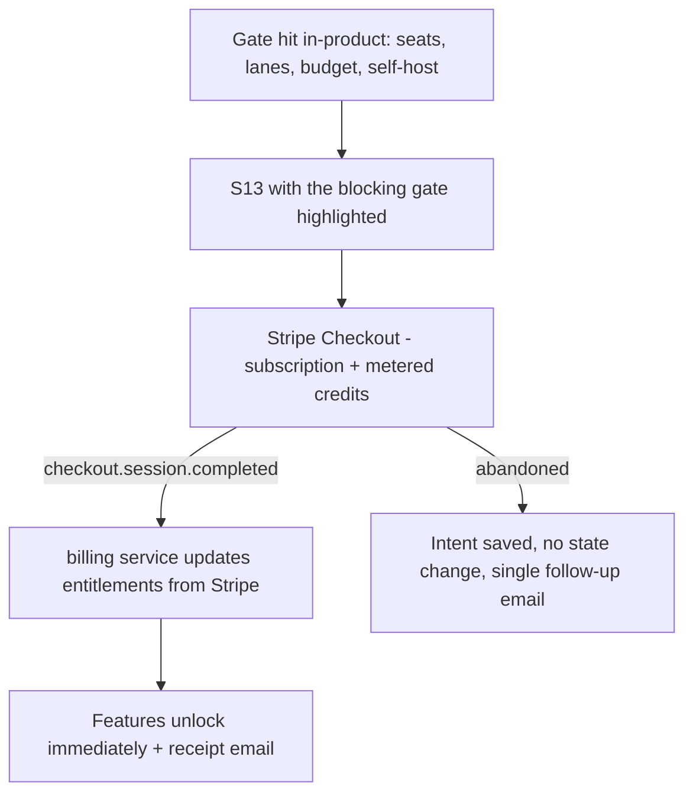

# 11 Monetization and Billing — Quorum

## 1. Business model

Hybrid **seat + credit** subscription, deliberately designed against the category's observed
pricing failure mode: a competitor's mid-2026 move to per-review overage produced public backlash
(`SOURCES.md` S17). Quorum's rule is **no surprise bills, ever** — the default overage policy is to
degrade to observe mode rather than to charge.

- A **seat** is a user who authored or reviewed a PR that Quorum reviewed in the billing period.
  Passive viewers, auditors, and bots are free.
- A **credit** is the unit of pipeline work. A typical full review of a 300-line PR costs ~3
  credits (`07_AI_OR_AUTOMATION_PIPELINE.md` §8). Skipped and observe-mode runs cost 0.2 credits.
  Deterministic-only runs cost 0.5 credits.
- Bring-your-own model endpoint reduces credit consumption to a fixed orchestration fee of 0.5
  credits per run, since inference is then the customer's cost.
- **Adaptive routing lowers the bill, it does not change the price.** Credits are charged on the
  tiers actually used, so a run that never needed a strong model costs less; the routing report
  shows realised savings against an all-strong baseline. Routing is never varied by plan — a Free
  finding is verified by the same strong model as an Enterprise one (`07_AI_OR_AUTOMATION_PIPELINE.md` §7.7).

## 2. Plans

| | **Free** | **Team** | **Business** | **Enterprise** |
|---|---|---|---|---|
| Price | $0 | $19 / active dev / month (annual), $24 monthly | $39 / active dev / month (annual), $49 monthly | Custom |
| Included credits | 150 / month / org | 300 / seat / month | 800 / seat / month | Negotiated |
| Repos | Unlimited public, 1 private active | Unlimited | Unlimited | Unlimited |
| Lanes | correctness, security | + api_contract, tests, style | + performance, data_migration, concurrency, custom rules | + custom lanes (P2) |
| Comment budget ceiling | 5 | 15 | 25 | 25 |
| Verification | Yes (single-model) | Yes | Yes, cross-provider | Yes, cross-provider |
| Rules with specs | — | 10 rules | Unlimited | Unlimited |
| Auto-fix (approval-gated) | — | Suggestions only | Suggestions + fix PRs | Same |
| Bot approval | — | — | Yes (off by default) | Yes |
| Trace retention | 7 days | 30 days | 90 days | Configurable to 180 |
| SSO / SCIM | — | — | SSO | SSO + SCIM |
| Audit log export / SIEM stream | — | 90 days | 2 years + stream | Same |
| Self-hosted licence | — | — | Add-on | Included |
| BYO model endpoint | — | Yes | Yes | Yes |
| Region pinning (US/EU) | — | — | Yes | Yes |
| Support | Community | Email, 2 business days | Priority, 1 business day | SLA + named contact |

**Free tier is genuinely useful** (unlimited public repos, full verification) because OSS
maintainers are the distribution channel, and because a reviewer people distrust cannot be sold
on a demo.

Credit top-ups: $8 per 100 credits, purchasable in advance. Overage is **never** charged unless
the org explicitly sets `overage_policy = notify_only` and provides a card.

## 3. Free versus paid boundary

Free gets: the whole verification pipeline, the dashboard, the trace, the CLI, dismissals and
feedback. Paid gets: more lanes, more budget, cross-provider verification, rules, auto-fix,
governance (SSO, audit export, region pinning), self-hosting, and higher retention. Nothing that
affects *comment quality on the findings it does post* is paywalled — a free-tier comment is as
verified as an enterprise one. What scales with price is breadth, governance, and volume.

## 4. Purchase flow

- **Source of truth for entitlements is Stripe**, mirrored into `subscription` and applied by
  webhook. The app never grants entitlements from a client-side success redirect.
- Seat counting is retroactive per period: active developers are computed nightly; a mid-period
  seat increase is prorated by Stripe, a decrease applies next period.
- Metered credits are reported to Stripe hourly in aggregate from `usage_record`, with an
  idempotency key per `(org, period, hour)`.

## 5. Entitlement enforcement

Every gated capability resolves through one `Entitlements` object loaded per request from the
subscription record, with a 60-second cache. Enforcement is server-side only; the UI hides gated
controls but the API is the authority. Grace behaviour:

| State | Behaviour |
|---|---|
| `trialing` | Full Business features for 14 days, no card required, hard credit cap of 400 |
| `active` | Normal |
| `past_due` | Banner + email at day 0, 3, 6; full function for 7 days; then degrade to `observe` (analysis continues, nothing posts) |
| `canceled` | Immediate downgrade to Free limits; data retained for the retention window with a visible countdown; no deletion without explicit request |
| Credit cap reached | `overage_policy=degrade` → observe mode with an explanatory summary comment; `notify_only` → continue and bill, with alerts at 80/100/150% |

## 6. Refunds, cancellation, restore

- Self-serve cancellation from S13 at any time, effective at period end, with a one-click
  reactivation for 30 days that restores the previous configuration.
- Annual plans: prorated refund within 30 days of purchase, no questions; after that, credit toward
  the next period.
- **Quality refund policy** (a deliberate marketing commitment): if an org's posted-comment
  acceptance rate over a full billing period is below 50%, that period's subscription fee is
  refunded on request. This is only safe to offer because the metric is measured and visible in
  S10 — it also aligns the roadmap with precision rather than volume.
- Failed payments follow Stripe Smart Retries; a 7-day grace precedes any degradation.
- Self-hosted licences are annual, offline-verifiable, and fail *open* (the product keeps working
  and warns) rather than shutting off a customer's review pipeline on a licence-server hiccup.

## 7. Server-side validation

Stripe webhook signatures verified; every entitlement change is audit-logged with the Stripe event
id; replays are idempotent on the event id. Credit consumption is written inside the same
transaction that finalises a run, so a crash cannot double-charge or silently under-charge. A
nightly reconciliation compares `usage_record` totals against Stripe-reported usage and alerts on
drift above 1%.

## 8. Paywall principles

1. Never interrupt a review in progress with a paywall; degrade at the next run boundary and say so.
2. Show the gate where it is hit, with the exact limit and the current usage, not a generic upsell.
3. Never hide a finding that was already posted behind a plan change.
4. Show cost before it is spent (`FR-072`) and after it is spent (in the summary comment).
5. No dark patterns: cancellation is self-serve and takes the same number of clicks as upgrading.
